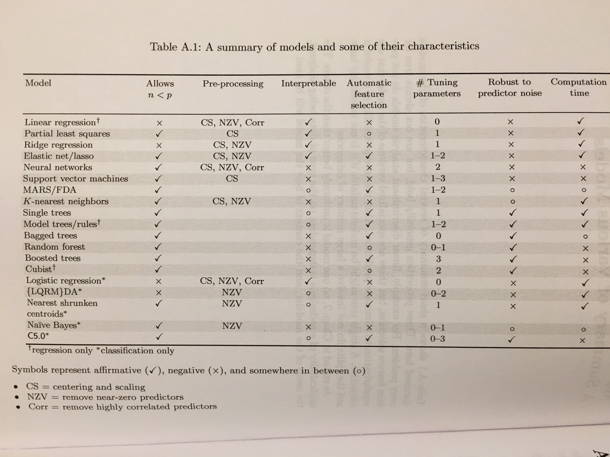

Code snippets from this wonderful book's  `AppliedPredictiveModeling` package.
`caret` is in maintainance mode, new development is focused on
[`tidymodels`](https://github.com/tidymodels/tidymodels).

```{r setup, include=FALSE, eval=FALSE}
knitr::opts_chunk$set(echo = TRUE)

install.packages(c('caret', 'corrplot', 'pls', 'e1071', 'kernlab', 'ipred',
                   'MASS', 'doMC', 'elasticnet', 'party', 'partykit',
                   'lars', 'randomForest', 'gbm', 'xgboost',
                   'glmnet', 'pamr', 'pROC', 'rms', 'sparseLDA', 'subselect'))

library(AppliedPredictiveModeling)
library(caret)
# library(corrplot)
```

# Quick Reference




## Model Weaknesses

### Models sensitive to **centering & scaling**

* PCA, because PCA tries to explain variance.
* PLS, same as PCA.
* SVM, because kernel is sum of cross products of support vectors and new
samples.
* KNN, based on distance measure so scale can have huge impact.
* LDA, also remove near zero variance predictors.

Those **less** sensitive: trees.


### Models sensitive to **Outliers**

* OLS, because of the tendency to reduce residual for outliers.
* PCA, because of variance caused by outliers.

Less sensitive to **outliers**:

* Robust linear regression with Huber loss
* Trees based methods (due to splits)
* SVM (due to support vectors)

### **Collinearity**

* Linear regression, causing unstable coefficients / large variance
* Logistic regression, unstable coefficients / large variance
* LDA, better than logistic regression but still breaks when multicollinearity
becomes extreme.
* Trees, choice of which correlated feature to split becomes somewhat random,
also impact importance values.

TODO: methods to combat collinearity

* `findCorrelation()`, then remove columns with high correlation
* p311, `subselect::trim.matrix()` to eliminate linear combinations, takes
a covariance matrix as input.
  * trimmed columns are stored in `names.discarded`
* `caret::findLinearCombos()`


* PLS / PCA
* Removing pair-wise highly correlated predictors

### Number of features **larger** than number of samples, $N < p$

* Linear regression, cannot invert $X^T X$
* Logistic regression, but can be addressed by adding L2 penalty.
* LDA, cannot invert covariance matrix of the data. Could happen in CV when
some data is reserved for validation.


## Model Comparson Plots and Functions:

* `lattice::xyplot()`, for regression, **predicted vs targets** and
**predicted vs residuals**. Supports formula.

* `caret::defaultSummary()` for model summary.

* `caret::featurePlot()` shows univariate plot of feature vs tarets.

* `Hmisc::describe()` describes data by colume, p228

* `parallelPlot(model)` **parallel-coordinate plots**: p230-231,
use line plots to show resampledresults (RMSE or $R^2$) across different models.
Each line shows the **same** sample set across all models.

* `caret::xyplot.resamples()` plots performance metrics from different CV folds
for a list of models. see `?xyplot.resample` example section.

* `corrplot::corrplot(..., order='hclust')` for correlation matrix.


## `R` Coding

### Formula

* `.` represent everything, e.g. `outcome ~ .`
* `(.)^2` expandas into model with all linear terms and all **two-factor**
interactions
* `I()` **as is** function, e.g. `I(feature^2)` will use squared feature
* `expand.grid()` to generate combinations of tuning parameters.

Use `paste()` and `as.formula()` to create formula from multiple string text.

```{r paste, eval=FALSE}
f <- paste('out ~ x + ', 'y + I(c^2)')
f <- as.formula(f)
```


# Data Preprocessing

`caret::preProcess()` can apply a pipeline of transformations to given data.

`caret::predict()` applys a model or transformation to given data.

## Transforming Features

Rule of thumb: ratio of highest and lowest values **exceeds 20 indicates**
significant skewness.

Or compute **skewness statistics** with `e1072::skewness()`.

To resolve skewness in data, can apply either **log, square root or inverse**.

Alternatively, use **Box-Cox** transformations `caret::BoxCoxTrans()`, which is
more straightforward, less prone to numerical issues and just as effective as
Box and Tidwell. It can only be applied to data that is **strictly positive**.
Box-Cox is a family of transformations:

$$
\begin{aligned}
x^* = \begin{cases}
\frac{x^\lambda - 1}{\lambda} & \text{if } \lambda \neq 0 \\
\log(x) & \text{otherwise}
\end{cases}
\end{aligned}
$$

```{r boxcox, eval=F}
# compute box-cox transform lambda
Ch1AreaTrans <- BoxCoxTrans(segData$AreaCh1)
# apply box-cox transform
predict(Ch1AreaTrans, head(segData$AreaCh1))
```

The **logit** transformation could be used to sequeeze data into the values
between 0 and 1.

$$ logit(\pi) = \log \bigg( \frac{\pi}{1 - \pi} \bigg) $$

Alterantive to logit is **arcsine** transform, which is primarily used on
square root of proportions (e.g. $y = arcsine(\sqrt{\pi})$)


## Transformation for Outliers / Examples

Tree-based models (due to splits) and SVM classification models (due to
support vectors) are **less prone to outliers**.

Center and scale data, then apply **spatial sign** transformation
`caret::spatialSign()`. It projects predictor values onto a multi-dimensional
sphere, this has the effect of making all samples to have the same distance
from the center of the sphere.
Mathematically, each sample is divided by its Euclidean norm:

$$ x^*_{ij} = \frac{x_{ij}}{\sqrt{x_{ij}^2}} $$

## Transformation for Entire Dataset

PCA is such an example. `prcomp()`

$$ PC_1 = (a_{j1} \times Predictor_1) + (a_{j2} \times Predictor_2) + \cdots
+ (a_{jp} \times Predictor_p) $$

Coefficients $a_{j1}, a_{j2}, \cdots, a_{jp}$ are known as **loadings**,
stored in returned result from `prcomp()` as `rotation`. See example in
code below to compute score matrix from data and loadings.

Use `lattice::splom` to plot loadings vs componements. See book example.

PCA is naturally drawn to summarizing predictors that have more variation,
therefore **centering and scaling** is very important for PCA.

When using scatter plot to show pairs of princial components, it is important
for the charts to have the **same scale**. Otherwise the effects may be
distorted by different scale graphically. Components / transformed values are
stored in `precomp()` result as `x`.


```{r pca, eval=F}
# pca for 2 predictors
pr <- prcomp(~ AvgIntenCh1 + EntropyIntenCh1,
             data = segTrainTrans,
             scale. = TRUE)

# loadings
pr$rotation
# how to go from loadings to PC / score matrix
x.rep <- as.matrix(segTrainTrans[,c('AvgIntenCh1', 'EntropyIntenCh1')]) %*%
  pr$rotation
all.equal(pr$x, x.rep)

transparentTheme(pchSize = .7, trans = .3)

xyplot(AvgIntenCh1 ~ EntropyIntenCh1,
       data = segTrainTrans,
       groups = segTrain$Class,
       xlab = "Channel 1 Fiber Width",
       ylab = "Intensity Entropy Channel 1",
       auto.key = list(columns = 2),
       type = c("p", "g"),
       main = "Original Data",
       aspect = 1)

xyplot(PC2 ~ PC1,
       # here are the components
       data = as.data.frame(pr$x),
       groups = segTrain$Class,
       xlab = "Principal Component #1",
       ylab = "Principal Component #2",
       main = "Transformed",
       xlim = extendrange(pr$x),
       ylim = extendrange(pr$x),
       type = c("p", "g"),
       aspect = 1)

## Plot a scatterplot matrix of the first three rotation variables

transparentTheme(pchSize = .8, trans = .7)
panelRange <- extendrange(segRot[, 1:3])
library(ellipse)
upperp <- function(...) {
    args <- list(...)
    circ1 <- ellipse(diag(rep(1, 2)), t = .1)
    panel.xyplot(circ1[,1], circ1[,2],
                 type = "l",
                 lty = trellis.par.get("reference.line")$lty,
                 col = trellis.par.get("reference.line")$col,
                 lwd = trellis.par.get("reference.line")$lwd)
    circ2 <- ellipse(diag(rep(1, 2)), t = .2)
    panel.xyplot(circ2[,1], circ2[,2],
                 type = "l",
                 lty = trellis.par.get("reference.line")$lty,
                 col = trellis.par.get("reference.line")$col,
                 lwd = trellis.par.get("reference.line")$lwd)
    circ3 <- ellipse(diag(rep(1, 2)), t = .3)
    panel.xyplot(circ3[,1], circ3[,2],
                 type = "l",
                 lty = trellis.par.get("reference.line")$lty,
                 col = trellis.par.get("reference.line")$col,
                 lwd = trellis.par.get("reference.line")$lwd)
    panel.xyplot(args$x, args$y, groups = args$groups, subscripts = args$subscripts)
}

segRot <- pr$rotation
splom(~segRot[, 1:3],
      groups = segRot$Channel,
      lower.panel = function(...){}, upper.panel = upperp,
      prepanel.limits = function(x) panelRange,
      auto.key = list(columns = 2))
```


## Missing Data

**Informative missingness**: missing data pattern is instructional on its own,
e.g. its pattern is related to the outcome. E.g. customer ratings, those who
rate usually have strong opinions, either good or bad.

For some data where below a certain threshould it becomes harder to measure by
the device at hand, we can impute them as a random number between 0 and the
device lowest threshold.

Some methods such as tree-based models can specifically account for missing
values. Ch. 8 for more.

Most relevant scheme is to build an **imputation model** for each predictor in
the dataset.

* K-means and take average
  * Pros: imputed data is confined to be within the range of training set
  values.
  * Cons: entire training data has to be stored; number of neighbour is a
  tuning parameter. (Troyanskaya et al. 2001 showed that nearest neighbour
  approach to be fairly robust to the tuning parameters, as well as the
  amount of missing data)

Some data that has very little variation can be removed. `caret::nearZeroVar()`
method can help to identify those columns / predictors.

FES book also has a section on imputation, using KNN, trees and linear methods.


## Collinearity / Multicollinearity

PCA can help. If the first PC accounts for a large % of variance, it implies
that there is at least one group of predictors that represent the same
information.

PCA **loadings** can be used to understand which predictors are associated with
each component to tease out this relationship.

**VIF**, variance inflation factor, can be used to identify multicollinearity,
but beyond linear regression, it may be **inadequate**:

* designed for linear models, requires n > p, more samples than predictors
* when it identifies issues, it does not determine which should be reomoved to
solve the problem.

p47, The book includes a huristic algorithm that iteratively
**remove predictors** by looking at correlated predictor pairs and the remove
the one with the **higher average correlation** with the rest of the predictors.


## One-Hot Encoding

When converting categorical variables to one-hot encoding format, use
`num_category - 1` if model has an intercept, otherwise if using `num_category`
there may be **numerical issues**, i.e. collinearity.

Use `dummyVars()` to create one-hot encoding. Formula based method by default
creates `n` variables for `n` unique values.
Book recommends to use the  **full set of dummy variables** (i.e. n-columns,
not n-1 columns) when working with **tree-based** models.

Alternatively, use `model.matrix()` with formula, which creates n-1 columns
for n unique values, plus a intercept column.

```{r one.hot, eval=F}
# levelsOnly removes predictor names in the new one-hot matrix
simpleMod <- dummyVars(~Mileage + Type, data=data, levelsOnly=TRUE)

# Mileage is numerical, Type is categorical, converts Type to one-hot
predict(simpleMod, data)

# example, full set vs the other
d <- as.data.frame(list(tt=c('one', 'two', 'three')))
predict(dummyVars(~ tt, data=d, levelsOnly = T), newdata = d)
# with n-1 columns
predict(dummyVars(~ tt, data=d, levelsOnly = T, fullRank = T), newdata = d)

# or using model.matrix()
# with intercept
model.matrix(~ tt, d)
# without intercept
model.matrix(~ tt - 1, d)
```


## Binning

Never mannually bin continuous variables.


## Code

```{r prepro, eval=FALSE}
data(segmentationOriginal)
segData <- subset(segmentationOriginal, Case == 'Train')
cellID <- segData$Cell
class <- segData$Class
case <- segData$Case
segData <- segData[, -(1:3)]
statusColNum <- grep('Status', names(segData))
segData <- segData[, -statusColNum]

skewness(segData$AngleCh1)
skewValues <- apply(segData, 2, skewness)
head(skewValues)

# compute box-cox transform lambda
Ch1AreaTrans <- BoxCoxTrans(segData$AreaCh1)
# apply box-cox transform
predict(Ch1AreaTrans, head(segData$AreaCh1))

pc <- prcomp(segData, center=TRUE, scale. = TRUE)
pc.var <- pc$sdev^2 / sum(pc$sdev^2)*100

trans <- preProcess(segData, method=c('BoxCox', 'center', 'scale', 'pca'))
trans
# apply transformation
data.trans <- predict(trans, new.data)

# beautiful correlation matrix
corrplot(cor(segData), order='hclust')

```


# Overfitting / Model Tuning

## Data Splitting

`caret::createDataPartition(classes, p=.8, list=FALSE)`

Resampling usually produced better results than a single test set.

**Stratified Random Sampling** draws random samples within each subgroup of
the data.

**Maximum dissimilarity sampling**, computationally high cost as it'd require
a lot of pair-wise computation. p68. `maxDissim()`

## Resampling

### `k`-Fold Cross Validation

```{r kfold, eval=FALSE}
library(AppliedPredictiveModeling)
data(twoClassData)

# a few different ways to do the same
caret::createDataPartition(classes, p=.8, times=3)
caret::createFolds(data, k=10, returnTrain=TRUE)
caret::createMultiFolds(classes, k = 10, times=3)
```

Randomly sample and divide data into train / validation sets, repeat `k` times
and take the average performance.

As `k` gets **larger**, the difference in size between the training set and the
resampling subset gets **smaller**, the **bias** of the technique **decreases**.

`k`-fold CV generally has **high variance** compared to other methods, might
not be attractive. With large training sets, the potential issue with variance
and bias become negligible.

### Generalized CV (GCV)

GCV is a statistic for approximating the leave-one-out CV error rate for linear
regression models.

Two models with the same MSE would have different GCV values if the complexities
of the models were different.

$$ GCV = \frac{1}{n} \sum^n_{i=1} \bigg( \frac{y_i - \hat{y}_i}{1 - df / n} \bigg)^2 $$

Where `df` is degree of freedom / # of parameters estimated by the model.

## Repeated Training / Test Splits

Aka Leave Group Out CV, or Monte-Carlo CV.

Repeatedly resample with replacement and split data into **modeling** and
**prediction** sets,

Bias decreases as the amount of data in the subset approaches the amount in the
modeling set. Rule of thumb 75-80%.

**Higher** no. of repetitions **decreases** the uncertainty of the performance
estimate. Book recommends 50-200 iterations (i.e. large) to get stable estimates
of performance.


## Boootstrap

Randomly resample data **with replacement**. Samples not selected are referred
to as **out-of-bag** samples.

Bootstrap error rates tend to have **less uncertainty** than k-fold CV. However,
on average **63.2%** of the data in bootstrap is represented at least once,
therefore this technique has **bias similar** to k-fold CV when $k \approx 2$.
This bias will decrease as training size becomes larger.

### 632 Method

To address the bias issue, the 632 method combines simple bootstrap error estimate
and the error estimate from re-predicting the training set (aka. the **apparent
error rate**).

632 error = 0.632 * simple bootstrap estimate + 0.368 * apparent error rate

where **apparent error rate =  train data error rate**

632 method reduces bias but can be unstable with small sample size. It can
still result in unduly optimisitic results when the model **severely** overfits,
i.e. **apparent error rate is close to zero**. Clearly, from the formula
you can see that when apparent error rate is 0, 632 error would be downward
biased.

**632+ method** was created to address this severely overfit case.
Good [post](https://stats.stackexchange.com/questions/96739/what-is-the-632-rule-in-bootstrapping).

$$ Err_{.632+} = (1 - w) err + w \times Err_{boot(1)} $$

Where:

* $err$ is the apparent error rate / training set error rate
* $Err_{boot(1)}$ is the leave-one-out bootstrap error rate
* $w = \frac{0.632}{1 - 0.632 R}$
* $R = \frac{Err_{boot(1)} - err}{\gamma - err}$
* $\gamma = \frac{1}{N^2} \sum_{i=1}^{N} \sum_{j=1}^{N} L\big(y_i, f(x_i)\big)$ is the no-information error rate

## Author's recommendations

No resampling method is uniformly better than others.

If sample size is small, use repeated 10-fold CV:

* Good bias and variance properties
* computational cost not high

For model selection, use bootstrap methods given low variance.

For large data set, the differences between resampling methods become less
pronounced, use simple 10-fold CV, which gives acceptable variance and low bias.

See later chapters for **optimization bias** for small datasets.

## Model Selection

Here the tips are actually quite similar to what Andrew Ng gave for DL models.

Essentially fit a more flexible / complicated model first to discover
**performance ceiling**. Then use simpler models and choose one that is
reasonaly close to the complex model.

With increased precision, there is higher likelihood that models can be
differentiated in terms of **sensitivity** than for **specificity**.


## Parameter Tuning

Examples below. For a ful list of `trainControl()` `method=`,
see [here](https://topepo.github.io/caret/model-training-and-tuning.html#control).

```{r resample, eval=FALSE}
data(GermanCredit)

library(doMC)
# register to use 8 cores
registerDoMC(8)

GermanCredit <- GermanCredit[, -nearZeroVar(GermanCredit)]
GermanCredit$CheckingAccountStatus.lt.0 <- NULL
GermanCredit$SavingsAccountBonds.lt.100 <- NULL
GermanCredit$EmploymentDuration.lt.1 <- NULL
GermanCredit$EmploymentDuration.Unemployed <- NULL
GermanCredit$Personal.Male.Married.Widowed <- NULL
GermanCredit$Property.Unknown <- NULL
GermanCredit$Housing.ForFree <- NULL

## Split the data into training (80%) and test sets (20%)
set.seed(100)
inTrain <- createDataPartition(GermanCredit$Class, p = .8)[[1]]
GermanCreditTrain <- GermanCredit[ inTrain, ]
GermanCreditTest  <- GermanCredit[-inTrain, ]

# a few methiods availalbe
# e1071::tune()
# ipred::errorest()
# Design::validate()

svm.fit <- caret::train(Class ~ .,
                        data=GermanCreditTrain,
                        method='svmRadial',
                        preProc=c('center', 'scale'),
                        # tune SVM cost parameter from [2^-1, 2^-2, ..., 2^7]
                        tuneLength=10,
                        # by default bootstrap is used to evaluate performance
                        # use trainControl() to use k-fold CV.
                        trControl=trainControl(method='repeatedcv',
                                               repeats = 5,
                                               classProbs = TRUE))

plot(svm.fit, scales=list(x=list(log=2)))

glmProfile <- train(Class ~ .,
                    data = GermanCreditTrain,
                    method = "glm",
                    trControl = trainControl(method = "repeatedcv",
                                             repeats = 5))


# To compare models
resamp <- caret::resamples(list(SVM = svm.fit, Logistic = glmProfile))
summary(resamp)

# diff methods is used to make inferences about differences between models
model.diff <- diff(resamp)
summary(model.diff)
# Accuracy based tests
model.diff$statistics$Accuracy

predictedProbs <- predict(svm.fit, newdata = GermanCreditTest, type = "prob")
head(predictedProbs)

```

# Regression Performance Measurement

## $R^2$

$R^2$ is a measure of correlation, **not accuracy**.

It depends on the **variation** in the outcome. If RMSE is 1, for outcomes with
variance 4 and 3, $R^2$ is 3/4 and 2/3 respectively.

**Rank correlation, Spearman's rank correlation**, to compute this, rank the
observed and predicted outcomes, the correlation between these rank is
calculated. `corr(..., method='spearman')`

## Bias-Variance Trade-off

For $MSE = \frac{1}{n} \sum^n_{i=1} (y_i - \hat{y}_i)^2$, with **assumptions**:

1. data points are statistiaclly independent
2. residuals have a theoretical mean of zero and constant variance $\sigma^2$,
which is called the **irreducible noise**.

We have:

$$ \mathbb{E}(MSE) = \sigma^2 + (\text{Model Bias})^2 + \text{Model Variance}$$

`extendrange(c(1, 5))` extends a numerical range by a percentage.

`abline()` base plot function to add a line in a chart.

A useful **diagnosis plot** is to plot:

1. observed values versus predicted
2. predicted values versus residual


# Linear Regressin & Its Cousins

Given $y = \beta X$ the solution is $\beta = (X^T X)^-1 X^T y$

A unique solution of $(X^T X)^-1$ exists when:

1. no predictor can be determined from a combination of one or more of the
other predictors
2. the number of samples is greater than the number of predictors

When **collinearity** exists, R fits the largest identifiable model by
removing variables in the reverse order of appearance in the model formula.

Another **drawback** of multiple linear regression is that the solution is a
hyperplane, which cannot handle curvature or nonlinear structure.

**Robust linear regression** using **Huber loss** (uses squared loss when error
is small and L1 loss when error is above a threshold) can defend against
outliers.

## Partial Least Squares

Package: `pls::plsr()`

High collinearity results in high variance in OLS parameters. Solution could
be:

1. Remove highly correlated predictors described in Section 3.3
2. usd PCA

(1) does not resolve multi-collinearity issue, hence does not guarantee a
stable least squares solution.

PCA does **not** necessarily produce new predictors that explain the response.
PCA tris to explain the variability, however, if the variability in the
predictor space is not related to the variability of the response, **PCR**
can have difficulty identifying a predictive relationship when one might exist.

Author recommends **PLS** when there are correlated predictors and a linear
regression type solution is desired.

**PLS** finds linear combinations of the predictors (components), aiming to
**maximize component covariance with the response**, i.e. it finds components
that:

* maximally summarize the variation of the predictors while simultaneously
* requiring these components to have maximum correlation with the response

Like PCA, data need to be **centered and scaled** before applying `PLS`.

`PLS` has one tuning parameters: number of components to retain. Resampling
can be used to determine the optimal number of components.

NIPALS algorithm works well for small/moderate datasets (e.g. $< 2500$ samples
and $< 30$ predictors). Dayal & MacGregor (1997) is the most computationally
efficient for various sizes (e.g. 500-10000 samples, 10-30 predictors,
1-15 responses, 3-10 components).

`PLS` components summarize the data through linear strctures of the original
predictor space that are related to the response. When more intricate
relationships exist, authoers suggest employing other techniques, rather than
trying to improve `PLS` through augementation.

### Variable Importance in the Projection (VIP)

`k`-component case, for the importance of $j$th predictor:

* numerator: weighted sum of normalized weights corresponding to the $j$th
predictor
* denominator: total amount of response variation explained by all `k`
components.

Rule of thumb: VIP > 1.0 is considered to have predictive information for the
response

## Penalized Models

Combating **colinearity** by using **biased** models may result in regression
models where the **overall MSE** is competitive.

**LARS** model can be used to fit lasso models more efficiently, especailly
in high dimensional problems.

Elastic net allows for effective regularization via L2 loss with feature
selection quality of lasso L1 penalty.

## Code

```{r linear_reg, eval=FALSE}
data(solubility)

set.seed(2)

trainingData <- solTrainXtrans

# visualize data vs target
featurePlot(solTrainXtrans[, -notFingerprints],
            solTrainY,
            between = list(x = 1, y = 1),
            type = c("g", "p", "smooth"),
            labels = rep("", 2))

# fit linear model
trainingData$Solubility <- solTrainY
lmFit <- lm(Solubility ~ ., data=trainingData)

summary(lmFit)
lmPred <- predict(lmFit, solTestXtrans)
lmValues <- data.frame(obs=solTestY, pred=lmPred)

# caret::defaultSummary() to estimate performance
defaultSummary(lmValues)

# robust linear model rlm()
lmFit <- rlm(Solubility ~ ., data=trainingData)

# use 10-fold CV
ctrl <- trainControl(method = 'cv', number=10)
set.seed(100)
lmFit1 <- train(x = solTrainXtrans, y = solTrainY, method='lm',
                trControl = ctrl)

# find highly correlated predictors and remove
tooHigh <- findCorrelation(cor(solTrainXtrans), .9)
trainXfiltered <- solTrainXtrans[, -tooHigh]
testXfiltered  <-  solTestXtrans[, -tooHigh]

lmTune <- train(x = trainXfiltered, y = solTrainY,
                method = "lm",
                trControl = ctrl)

rlmPCA <- train(x = trainXfiltered, y = solTrainY,
                method = "rlm",
                # preProcess = c('center', 'scale', 'pca'),
                preProcess = 'pca',
                trControl = ctrl)
rlmPCA
```

```{r pls, eval=FALSE}
library(pls)
plsFit <- plsr(Solubility ~ ., data=trainingData)

# can choose number of component for prediction
predict(plsFit, solTestXtrans[1:5,], ncomp=1:2)

loadings(plsFit)
scores(plsFit)

scoreplot(plsFit)
plot(plsFit)

plsTune <- train(x = solTrainXtrans, y = solTrainY,
                 method='pls',
                 tuneLength = 20,
                 trControl = trainControl(method = 'repeatedcv',
                                          number = 10),
                 preProcess = c('center', 'scale'))
```

```{r penalized, eval=FALSE}
library(elasticnet)

# Ridge
lm.ridge()

# elastic-net, lambda parameter is ridge weight
# or (1-alpha) in glmnet package for L2 weights
elasticnet::enet(x = as.matrix(solTrainXtrans), y = solTrainY, lambda = .001)

```


# Non-Linear Methods

## MARS

Advantages:

* the model automatically conducts feature selection (uses GCV statistic, see
notes above).
* model equation is independent of the predictor variables that are not involved
with any of the final model features.
* Interpretability
* Needs little pre-processing

`MARS` found in `earth` package, useful functions:

* `earth::earth()` to fit a model
* `plotmo()` to plot
* `earth::evimp()` or `caret::varImp()` for variable importance
* `caret::train()` with `method = 'earth'`


```{r mars, eval=F}
marsTune <- train(x = solTrainXtrans, y = solTrainY,
                  method = "earth",
                  tuneGrid = expand.grid(degree = 1, nprune = 2:38),
                  trControl = ctrl)
```

## SVM

Book focuses on **$\epsilon$-insensitive regression**.

One drawback with minimizing MSE is that it is very sensitive to large outliers.

SVMs for regression use a function similar to the Huber function, but with
difference.

Given threshold $\epsilon$ give by user, data points with residuals **within**
the threshold do not contribute to the regression fit, while data points with
an absolute difference **greater** than the threshold contribute a linear-scale
amount. **Poorly predicted points define the line.**

Consequence:

1. more robust for outliers,
2. samples that fit well have **no effect** on the regression equation.

SVM is over-parameterized, but the cost value effectively regularizes the model,
helps to alleviate this problem.

Individual training data points are required for new predictions, these are
known as **support vectors**.

Authors found that the
**cost parameter provides more flexibility for tuning the model**
and therefore suggest **fixing** a value for $\epsilon$ and tuning over the
other kernel parameters.

Since the predictors enter into the model as sum of cross products, differences
in predictor scales can affect the model. Therefore, data should be
**centered and scaled** before feeding into svm.

Bayesian analog to SVM: *relevance vector machine* (Tipping 2001). There are
usually less relevance vectors than support vectors in model.

With `kernlab` package, different SVM kernels have different tuning parameters.
See SVM for classification for an example for radial basis kernel.

```{r svm, eval=FALSE}

# e1071::svm()
# kernlab package has more extensive implementation of SVM for regression
# use kernlab::ksvm
# kernlab laso has relevance vector machine, rvm()

library(kernlab)
data(solubility)

solTrainXtrans$solTrainY <- solTrainY

# supported kernels: rbfdot, polydot, vanilladot, etc.
svmFit <- ksvm(solTrainY ~ ., data = solTrainXtrans,
               # x = solTrainXtrans, y = solTrainY,
               kernel = 'rbfdot',
               kpar = 'automatic',
               C = 1, epsilon = .1)

# use train() to tune model. method parameter can take:
# svmRadial,
# svmLinear,
# svmPoly
# to fit different kernels
svmRTuned <- train(solTrainY ~ ., data = solTrainXtrans,
                   method = 'svmRadial',
                   preProc = c('center', 'scale'),
                   tuneLength = 14,
                   trControl = trainControl(method = 'cv'))

# to choose the selected model:
fm <- svmRTuned$finalModel

# to access the support vectors indices
fm@SVindex
```


## KNN

Data should be **centered and scaled** before feeding into KNN.

KNN has one parameter to tune: the number of neighbours, `k`.

KNN needs to store all training data, therefore is not memory efficient.

KNN can have **poor performance** when local predictor structure is not
relevant to the response.

## Code

Neural network package `nnet`.

`KNN` use `knnreg::knn()`


# Regression Trees / Rule-based Models

By construction, trees / rule-based models can effective handle many types
of predictors (sparse, skewded, continuous, categorical, etc.), **without**
the need to pre-process them.

No need to specify the form of the predictor's relationship with the response.

They can handle missing data and implicitly conduct feature selection.

## Single Tree Weaknesses:

1. model instability, e.g. a small change in data can drastically change the
structure of the tree.
2. Less than optimal predictive performance, due to rectanglur decision
boundries, which may not suit the data / true relationship.
3. For a single tree, the number of possible predicted outcome from a tree is
**finite** and is determined by the number of terminal nodes.
4. Trees suffer from **selection bias**: predictors with a higher number of
distinct values are favoured over more granular predictors.
5. As the number of missing values increase, the selection of predictors become
more **biased**.

Solution: ensemble methods.

## Trees

Single tree building:
`rpart::rpart()`
`party::ctree()`

### Cost Complexity Pruning

Goal of pruning is the find a right sized tree that has the smallest error
rate. Penalize the error rate using the size of the tree:

$$ SSE_{c_p} = SSE + c_p \times \text{# Terminal Nodes} $$

where $c_p$ is the tuned **complexity parameter**. Large values
may result the tree to have just one or no splits - which means that
**no predictor** adequately explains enough of the variance in the outcome at
the chosen value of complexity parameter.

Also uses **one-standard deviation** rule for model selection. Alterantively,
use tree associated with the numerically smallest error.

### Missing Values

Use **surrogate splits**. A surrogate split is one whose results are similar to
the original split actually used in the tree.

### Feature Importance

One way is to measure importance is to keep track of the overal reduction ni
the optimization criteria for each predictor.

**Disadvantage** of this approach: when some predictors are highly correlated,
the choice of which to use in a split is somewhat random. Which results in
more predictors being selected than those actually needed, affecting variable
importance values.

See Weakness section for more disadvantages (last paragraph page 180).

**Unbiased** regression trees:

* GUIDE
* conditional inference trees

Packages: `rpart`, `party`, `partykit`

### Single Tree Code

* `rpart::rpart()` - fits w/ CART
* `party::ctree()` - fits w/ conditional inference trees

```{r trees, eval=FALSE}
library(rpart)
library(party)
# Turning for rpart() is through paramter `rpart.control`
# for party::ctree() this is through `ctree_control`

# Or, via train() to tune both complexity parameter and max node depth.
# method = 'rpart' to tune over complexity parameter
# method = 'rpart2' to tune over max node depth.
# method = 'ctree' to tune mincriterion
# method = 'ctree2' to tune over max node depth.
rpartTuned <- train(solTrainY ~ ., data = solTrainXtrans,
                    method='rpart2', tuneLength=10,
                    trControl = trainControl(method = 'cv'))

library(partykit)
# plot tree
rpartTree2 <- as.party(rpartTree)
plot(rpartTree2)
```

## Regression Model Trees

`RWeka::M5P()` for trees

`RWeka::M5Rules()` for rule based model.

**Drawback** for simple regression trees: each terminal node uses the
**average** of the training set outcomes in the node for prediction.

**Implication**: the model may not do a good job in prediction outcomes
that are extremely high or low.

Alternatively, use a **different estimator** in the terminal node.

**Model tree** vs simple trees:

* split criterion is different
* terminal node predicts the outcome using a linear model
* when a sample is predicted, it is often a combination of the predictions from
different models along the same path through the tree.

Main implementation: **M5** in `Weka` package.

**Split** criterion:

The **expected reduction** in the node's error rate is used.

$$\text{reduction} = SD(S) - \sum_{i=1}^{P}\frac{n_i}{n} \times SD(S_i) $$

Where:

* $S$ is the entire dataset
* $S_1, \cdots, \S_P$ - $P$ subsets of the data after splitting
* $n_i$ number of samples in partion $i$

This metrics determines if the total variation in the splits, weighted by
sample size, is lower than in the presplit data.

See p185 for more details on tree construction.

### Model Trees Code

Packages: `RWeka`

`M5` model trees: `RWeka::M5P()` with formula interface. For `train()`,
use parameters:

* `method='M5'`
* `control = Weka_control(M = 10)` sets minimum number of training set points
required to create additional splits, default is 4.

`M5` results can be plotted by calling `plot(model)`.

## Rule-Based Model

p190

## Bagged Trees

Short for Bootstrap Aggregation.

$m$ models (e.g. unpruned trees) are trained using bootstrapped sample of
the original data. Results are then averaged.

Bagging advantages:

1. Effectively reduces variance of a prediction through its
aggregation process.
2. They provide their own internal estimate of predictive performance (using
**out of bag** data) that correlates well with either CV or test set estimates.

Bagging stable, lower variance models like linear regression and MARS offer
**less** improvment in predictive performance.

Tress are great for bagging because they have high variance.

One parameter to tune: number of bootstrap samples to aggregate $m$.

often we see exponential decrease in predictive improvement as the number of
iterations increases. The most improvments in prediction perforamnce is obtained
with a smaller number of trees (m < 10).

If performance is not at an acceptable level after 50 bagging iterations,
authors suggest trying other more powerful ensemble methods as random forest
and boosting.

**Caveats**:

1. high computational cost and memory requirement
2. bagged model is less intrepretable.

### Bagging Code

* `ipred::bagging()` - formula interface
* `ipred::ipredbagg()` - non-formula interface
* `caret::train()` with `method = 'treebag'`

Other ways:

* `RWeka::Bagging()`
* `caret::bag()` - general framework that works for many models
* `party::cforest()` - Conditional inference trees, with parameter:
`controls = cforest_control(mtry = ncol(trainData) - 1)` to set
$m_{try} = \text{# of predictors}$.


```{r bag, eval=F}
treebagTune <- train(x = solTrainXtrans, y = solTrainY,
                     method = "treebag",
                     nbagg = 50,
                     trControl = ctrl)

treebagTune
```

## Random Forest

Need to reduce tree correlation. Algo on page 200, 8.2 listing.

Algo randomly selects predictors at each split, decreases tree correlation.

***Tuning parameters***:

* number of randomly selected predictors, $k$, to choose from at each split,
referred to as $m_{try}$, `mtry` for `caret`
  * Breiman 2001 suggests setting $m_{try} = \frac{P}{3}$ where $P$ is the
  number of predictors, but better to use CV.
* number of trees for the forest. `ntree`

Breiman proved that RF is **protected from overfitting**. Authors found that
tuning parameters do not have a drastic effect on performance.

RF is robust to **noisy response**. The independence of learnings can underfit
data when response is not noisy.

Strobl et al. (2007) proved that the correlations between predictors can have a
significant impact on the importance value. E.g. non-informative predictor
that has high correlation with informative predictor end up having higher or
equal importance as weakly informative predictors.

Also showed that $m_{try}$ tuning parameter has a **series** effect on the
importance values.

Impact of between-predictor correlations is to **dilute the importance** of key
predictors. This is **not** addressed by Strobl's 2007 alternative importance
measure.

RF and single tree such as CART may have very different ordering of feature
importance, this highlights that a single tree's greediness prioritize
predictors differently than a RF.

### ESL on RF Chapter 15

In bagging each tree generated is **identically distributed** (*i.d.*),
which means the bias of bagged trees is the same as that of the individual tree,
and the only hope of improvement is through **variance reduction**.

This is different to boosting, where trees are grown in an adaptive way to
remove bias, and hence are not *i.d.*

An average of $B$ i.i.d. random variables, each with variance $\sigma^2$,
has variance of $\frac{1}{B} \sigma^2$. If the samples are i.d. only, with
**positive** pairwise correlation $\rho$, the variance of the average is:

$$ \rho \sigma^2 + \frac{1 - \rho}{B}\sigma^2 $$

As $B$ increases, the second terms disappears, hence the size of the
correlation of paris of bagged trees **limits the benefit of averaging**.

The idea of RF is to improve the variance reduction of bagging by
**reducing the correlation between the trees**,
without increasing variance too much**, achieved through the random feature
selection process in the tree-growing process.

#### **Overfitting**

On the claim that RF "cannot overfit" by having larger number of trees, $B$,
ESL quotes that Segal (2004) has demonstrated that small gain can be achieved
by controlling the depths of the individual trees grown in the RF.

Depth of the trees are controlled by **min node size**.

### RF Code

Package: `randomForest::randomForest()`

`ranger` package has a faster implementation of RF. `caret` can also be used
to train this version.

Parameters:

* `mtry` - number of predictors that are randomly sampled as candidates for
each split. Default is # of predictors / 3.
* `ntree` - # of bootstrap samples. Default 500, but should use at least 1000.
* `importance` - default is FALSE. First set to `TRUE` then call
`randomForest::importance(..., type=1, scale=F)` to get the right importance
values.

For `caret::train()`: `method = 'rf'` or `'cforest'`

For `cforest` objects, variable importance can be obtained by calling
`party::varimp()`

`caret::varImp()` has a **unified wrapper** that works for tree-models from:
`rpart`, `classbagg` produced by `ipred`'s bagging, `randomForest`,
`cforest`, `gbm`, and `cubist`

```{r reg_rf, eval=F}
library(AppliedPredictiveModeling)
data(solubility)

library(caret)
set.seed(100)

indx <- createFolds(solTrainY, returnTrain = TRUE)
ctrl <- trainControl(method = "cv", index = indx, savePredictions = T)

mtryGrid <- data.frame(mtry = floor(seq(10, ncol(solTrainXtrans), length = 10)))

### Tune the model using cross-validation
set.seed(100)
rfTune <- train(x = solTrainXtrans, y = solTrainY,
                method = "rf",
                tuneGrid = mtryGrid,
                ntree = 1000,
                importance = TRUE,
                trControl = ctrl)
rfTune

plot(rfTune)

rfImp <- varImp(rfTune, scale = FALSE)
rfImp

### Tune the model using the OOB estimates
ctrlOOB <- trainControl(method = "oob")
set.seed(100)
rfTuneOOB <- train(x = solTrainXtrans, y = solTrainY,
                   method = "rf",
                   tuneGrid = mtryGrid,
                   ntree = 1000,
                   importance = TRUE,
                   trControl = ctrlOOB)
rfTuneOOB
```

## Boosting

Several researchers showed that boosting can be interpreted as a forward
stepwise additive model that minimizes exponential loss.

Basic principles, see p205 for algo:

* Given a **loss function** and a **weak** learner, the algo seeks to find an
additive model that minimizes the loss function.
* The model is fit to the residual to minimize the loss
* The current model is added to the previous model, and the procedure continues
for a pre-defined number of iterations.

Requires a **weak** learner, almost any technique with tuning parameters can
be made into a weak learner. Trees are great for reasons below:

1. can be weak learner simply by restricting its depth
2. separate trees can be easily added together
3. trees can be generated quickly.

For **tree** based gradient boosting, two tuning parameters:
1. number of iterations
2. depth of each tree, aka. **interation depth**

Boosting applies a greedy strategy of choosing the optimal weak learner at each
stage. The **drawback** is that it might not find the optimal global model and
can overfit the training data.

Remedy: **regularization** (shrinkage), only a fraction of the current
predicted value is added
to the previous iteration's predicted value. The learning rate, $\lambda$ is
between 0 and 1.

**Stochastic Gradient Boosting** (Friedman) added another step in each
iteration: randomly sample a fraction of the training data to be used in
the current training iteration. This fraction can be tuned in CV.

**Variable importance** for boosting is a function of the reduction in squared
error: the improvment in squared error due to each predictor is summed within
each tree in the ensemble, then this improvment sum is averaged over the
ensemble to yield an overall importance value.

The **importance profile** for boosting has a much **steeper** slope than the on
for random forest. This is due to the fact that the trees in boosting are
dependent on each other and therefore will have **correlated structures** as the
method follows by the gradient.

### Boosting Code

* `gbm::gbm.fit(x, y, distribution = 'gaussian')` - non-formula interface
* `gbm::gbm(y ~ x, data = data, distribution = 'gaussian')` - formula interface

`distribution` parameter defines the type of loss function that will be
optimized during boosting. Use `gaussian` for ** continuous response**.

Other **tuning parameters** for `gbm`:

* `n.trees` - number of trees
* `interaction.depth` - depth of trees
* `shrinkage` - learning rate, how much regularizaton, portion of the output
added to the previous iteration's predicted values, between 0 and 1.
* `bag.fraction` - proportion of observations to be sampled
* `n.minobsinnode` - min observations in node

For `caret::train()`, see below example:

```{r boost, eval=FALSE}
library(gbm)

gbmGrid <- expand.grid(interaction.depth = seq(1, 7, by = 2),
                       n.trees = seq(100, 1000, by = 50),
                       shrinkage = c(.01, .1),
                       n.minobsinnode=c(5, 10))

gbmTune <- train(solTrainY ~ ., data = solTrainXtrans,
                 method='gbm',
                 tuneGrid = gbmGrid,
                 verbose = F)
```

## Code

`train()` for regression, available `method=` are:

* `rpart`, `rpart2` - single regression tree, CART
* `ctree`, `ctree2` - conditional inference tree
* `M5` - rule based tree model
* `treebag` - bagging trees
* `rf` - random forest
* `cforest` - conditional inference forest
* `gbm` - boosting trees
* `cubist` - cubist

A more comprehensive list
[here](https://topepo.github.io/caret/available-models.html).


# Measuring Performance in Classification Models


## Well-Calibrated Probabilities

A few ways to do this:

* Use `caret::calibration()` and `xyplot`, example below
* `PresenceAbsence::calibration.plot`
* `gbm::calibrate.plot`

Predicted probabilities must be calibrated to effectively reflected the true
likelihood of the event of interest.

**Calibration Plot** shows observed probability of an event versus the predicted
class probabilities. Steps:

1. Train a classification model, predict class probabilities
2. Bin the data based on their class probabilities, e.g 0-10%, 10-20%, etc.
3. For each bin, determine the **observed event rate**. Eg. 50 samples have
class probabilities < 10%, but only 1 is the true event, the observed event
rate is $1 / 50 = 2%$.
4. Plot the midpoint of each bin on the x-axis and observed event rate on
y-axis.

Well calibrated models should see observed event rates fall on a **45-dgree**
line.

Predicted probabilities can be calibrated to more closely reflect the
likelihood of the data with post-processing. **Two methods**:

1. Use another model, example in the book used a logistic regression model
`glm()`.

$$ \hat{p}^* = \frac{1}{1 + \exp(-\beta_0 + \beta_1 \hat{p})} $$

Where:

* $\hat{p}$ uncalibrated class probabilities,
* $\beta$ are parameters estimated by predicting the true classes as a function
of the $\hat{p}$.

2. Use Bayes' Rule, example uses `NaiveBayes()`

Note that after calibration, the samples **must be reclassified** to ensure
consistency between the new probabilities and the predicted classes.

```{r calibrate, eval=F}
library(AppliedPredictiveModeling)

### Simulate some two class data with two predictors
set.seed(975)
training <- quadBoundaryFunc(500)
testing <- quadBoundaryFunc(1000)
testing$class2 <- ifelse(testing$class == "Class1", 1, 0)
testing$ID <- 1:nrow(testing)

### Fit models
library(MASS)
qdaFit <- qda(class ~ X1 + X2, data = training)
library(randomForest)
rfFit <- randomForest(class ~ X1 + X2, data = training, ntree = 2000)

### Predict the test set
testing$qda <- predict(qdaFit, testing)$posterior[,1]
testing$rf <- predict(rfFit, testing, type = "prob")[,1]

qdaTrainPred <- predict(qdaFit, training)
qdaTestPred <- predict(qdaFit, testing)

# QDA predicted classes are stored in $class
head(qdaTrainPred$class)
# QDA predicted class probabilities are stored in $posterior
head(qdaTrainPred$posterior)

# for random forsests, need 2x calls to get classes and probabilities
# class probabilities
rfTestPred <- predict(rfFit, testing, type='prob')
head(rfTestPred)
# class labels
rfTestPredLabels <- predict(rfFit, testing)
head(rfTestPredLabels)

### Generate the calibration analysis
library(caret)
calData1 <- calibration(class ~ qda + rf, data = testing, cuts = 10)

### Plot the curve
xyplot(calData1, auto.key = list(columns = 2))

### To calibrate the data, treat the probabilities as inputs into the
### model

trainProbs <- training
# predict training data Class 1 probabilities
trainProbs$qda <- predict(qdaFit)$posterior[,1]
head(trainProbs$qda)

### These models take the probabilities as inputs and, based on the
### true class, re-calibrate them.
library(klaR)
# usekernel = TRUE allows a flexible function to model the probability
# distribution of the class probabilities.
nbCal <- NaiveBayes(class ~ qda, data = trainProbs, usekernel = TRUE)

### We use relevel() here because glm() models the probability of the
### second factor level.
# relevel() reorders so "Class1" becomes the second level for glm()
lrCal <- glm(relevel(class, "Class2") ~ qda, data = trainProbs,
             family = binomial)

### Now re-predict the test set using the modified class probability
### estimates
# drop=FALSE here ensures that shape is not changed
testing$qda2 <- predict(nbCal, testing[, "qda", drop = FALSE])$posterior[,1]
testing$qda3 <- predict(lrCal, testing[, "qda", drop = FALSE],
                        type = "response")


### Manipulate the data a bit for pretty plotting
simulatedProbs <- testing[, c("class", "rf", "qda3")]
names(simulatedProbs) <- c("TrueClass", "RandomForestProb", "QDACalibrated")
simulatedProbs$RandomForestClass <-  predict(rfFit, testing)

calData2 <- calibration(class ~ qda + qda2 + qda3, data = testing)
calData2$data$calibModelVar <- as.character(calData2$data$calibModelVar)
calData2$data$calibModelVar <- ifelse(calData2$data$calibModelVar == "qda",
                                      "QDA",
                                      calData2$data$calibModelVar)
calData2$data$calibModelVar <- ifelse(calData2$data$calibModelVar == "qda2",
                                      "Bayesian Calibration",
                                      calData2$data$calibModelVar)

calData2$data$calibModelVar <- ifelse(calData2$data$calibModelVar == "qda3",
                                      "Sigmoidal Calibration",
                                      calData2$data$calibModelVar)

calData2$data$calibModelVar <- factor(calData2$data$calibModelVar,
                                      levels = c("QDA",
                                                 "Bayesian Calibration",
                                                 "Sigmoidal Calibration"))

xyplot(calData2, auto.key = list(columns = 1))
```


### Presenting Class Probabilities

For two classes, **histograms** of the predicted classes for each of the
true outcomes illustrate the strengths and weaknesses of a model. p252

* x-axis shows predicted probabilities of a class.
* y-axis shows the observed event count or rate, essentially a calibration
plot.
* Use one histogram for each class.

For **multi-classes**, use heat map of class probabilities, p253:

* x-axis shows true class labels
* y-axis shows different samples, so each row shows the class probability for
a sample.

```{r class_hist, eval=F}
library(caret)
data(GermanCredit)

## First, remove near-zero variance predictors then get rid of a few predictors
## that duplicate values. For example, there are two possible values for the
## housing variable: "Rent", "Own" and "ForFree". So that we don't have linear
## dependencies, we get rid of one of the levels (e.g. "ForFree")

GermanCredit <- GermanCredit[, -nearZeroVar(GermanCredit)]
GermanCredit$CheckingAccountStatus.lt.0 <- NULL
GermanCredit$SavingsAccountBonds.lt.100 <- NULL
GermanCredit$EmploymentDuration.lt.1 <- NULL
GermanCredit$EmploymentDuration.Unemployed <- NULL
GermanCredit$Personal.Male.Married.Widowed <- NULL
GermanCredit$Property.Unknown <- NULL
GermanCredit$Housing.ForFree <- NULL

## Split the data into training (80%) and test sets (20%)
set.seed(100)
inTrain <- createDataPartition(GermanCredit$Class, p = .8)[[1]]
GermanCreditTrain <- GermanCredit[ inTrain, ]
GermanCreditTest  <- GermanCredit[-inTrain, ]

set.seed(1056)
logisticReg <- train(Class ~ .,
                     data = GermanCreditTrain,
                     method = "glm",
                     trControl = trainControl(method = "repeatedcv",
                                              repeats = 5))
logisticReg

### Predict the test set
creditResults <- data.frame(obs = GermanCreditTest$Class)
creditResults$prob <- predict(logisticReg, GermanCreditTest, type = "prob")[, "Bad"]
creditResults$pred <- predict(logisticReg, GermanCreditTest)
creditResults$Label <- ifelse(creditResults$obs == "Bad",
                              "True Outcome: Bad Credit",
                              "True Outcome: Good Credit")

### Plot the probability of bad credit
histogram(~prob|Label,
          data = creditResults,
          layout = c(2, 1),
          nint = 20,
          xlab = "Probability of Bad Credit",
          type = "count")

### Calculate and plot the calibration curve
creditCalib <- calibration(obs ~ prob, data = creditResults)
xyplot(creditCalib)

### Create the confusion matrix from the test set.
confusionMatrix(data = creditResults$pred,
                reference = creditResults$obs)
```

### Equivocal Zones

One way to improve classification performance is to create an **equivocal**
or **indeterminate zone** where the class is not formally predicted when the
confidence is not high.

For $C$-class problem, use $1/C + z$ as threshold.

Model performance should be calculated excluding the samples in the
indeterminate zone.


## Evaluating Predicted Classes

Code: `caret::confustionMatrix()`

**Confusion matrix**, predicted events as rows, observed events as columns:

* Event: TP, FP
* Non-event: FN, TN

| | Event (Truth) | Non-Event (Truth) |
|:---:|:---:|:---:|
|Event (Predicted) | TP | FP |
|Non-Event (Predicted) | FN | TN |

Diagnol cells denote cases of correct predictions.

Ground truth # of events = TP + FN

**Sum of columns** show total number of ground truth for each class.

**Sum of rows** show total number of predictions for each class.

**Accuracy** = TP / (TP + FN), disadvantages:

* makes no distinction about the type of error being made
* one must consider the natural frequencies of each class.
  * What should be the right benchmark accuracy? E.g. always predict False
  for some rare event can have perfect accuracy.
  * The **no-information** rate is the accuracy rate that can be achieved
  without a model. Alternative definition is the percentage of the largest
  class in the training set (e.g. always predict to be that class).

**Kappa statistic / Cohen's Kappa** $= \frac{O - E}{1 - E}$

* $O$ is the observed accuracy
* $E$ is the expected accuracy based on the marginal totals of the confusion
matrix.
* value is $\in [-1, 1]$, 0 means no agreement between observed and predicted
classes, 1 indicates perfect agreement. Negative values indicate opposite
direction of the truth but it's rarely happens with classification models.

**Kappa stats** can be extended for multi-class problems. **Weighted Kappa**
can be used to penalize certain predictions.

## Two-Class Problems

Functions to compute these stats can be found in `caret` package:

* `sensitivity()`
* `specificty()`
* `posPredValue()`
* `negPredValue()`

Sensitivity and Specificity are both **conditional** measures, they show
probabilities given a class. In other words, they are **likelihoods**, not
to be confused with **posterior**.

To got to **unconditional** answers, we need **prevalence**.

To interpret them:

* sensitivity shows the % of correct prediction for the **event** class.
* specificity shows the % of correct prediction for the **nonevent** class.

Good reference [here](https://en.wikipedia.org/wiki/Precision_and_recall).

### Metrics

**Sensitivity / True Positive Rate / Recall** $= \frac{TP}{TP + FN}$,
denominator is the ground truth number of positive events.

**Specificity / True Negative Rate** $= \frac{TN}{TN + FP}$, denominator
is the ground truth number of negative events.

**False Positive Rate (FPR)** $= 1 - Specificity$, measure the % of **wrong**
predictions for the non-event class.

**ROC** curve plots FPR (x) vs Sensitivity (y).
It show that we wants **high** % of **correct** prediction for
the **event** class, and **low** % of **wrong** prediction for the **non-event**
class, i.e. high sensitivity and low FPR.

This compares to:

**Precision** $= \frac{TP}{TP + FP}$, a.k.a **Positive Predictive Value (PPV)**

**Negative Predictive Value (NPV)** $= \frac{TN}{TN + FN}$

PPV and NPV are **unconditional** measures, they embed prevalence info. p258

Authors indicated that PPV and NPV are **not** often used to characterize
the model. ROC curve actually does not use them. The reasons sited:

1. Typically prevalence is hard to quantify
2. Prevalence is also dynamic, i.e. it changes, or can be different in
different places or situations.

**Youden's $J$ Index** $= Sensitivity + Specificity - 1$ measures the
proportion of correctly predicted samples for both the event and nonevent
groups.

**Matthews Correlation Coefficient** is related to Youden's $J$ index. It has
a value between -1 and +1, and can be found in `ModelMetrics` package.
A value of +1 indicates perfect prediction, -1 means the worst possible, i.e.
predicting everything wrong.
It is defined, using terms from a confustion matrix, as:
(if any of the 4 denominator sums is 0 then the MCC is set to 0.)

$$ MCC = \frac{TP \times TN - FP \times FN}{\sqrt{(TP + FP)(TP + FN)(TN + FP)(TN + FN)}} $$

$MCC$ has a generalized form to handle multi-class problems.

`ModelMetrics` package also has a MCC implementation that supports multi class
problems. Example below to train with `caret::train` with custom metric.
The predicted classes and ground truth need to be in one hot encoding format.

`mccr::mccr()` only handles two-class problems, requires actual class labels
and predicted class labels, labels must be numeric, 1 for positive, 0 for
negative.

```{r mcc, eval=F}

library(ModelMetrics)

data(iris)

# custom function for model metrics
mccSummary <- function(data, lev = NULL, model = NULL) {
  # get the levels from target labels
  if(is.null(lev))
    lev <- levels(data$obs)
  num.classes = length(lev)

  # convert to one hot format
  oh <- dummyVars(~ obs, data = data)
  obs.oh <- predict(oh, newdata = data)

  # get class probabilities, make sure they are in the same column order
  # as target labels, mcc cannot take data.frame so need matrix as input
  pred.probs <- as.matrix(data[, lev])

  out <- ModelMetrics::mcc(actual = obs.oh,
                           predicted =pred.probs,
                           cutoff = 1 / num.classes)
  auc <- ModelMetrics::mauc(actual = obs.oh, predicted = pred.probs)

  return(c(MCC=out, AUC=auc[['mauc']], num.classes=num.classes))
}

ctrl <- trainControl(method='repeatedcv',
                     number = 10,
                     repeats = 5,
                     savePredictions = T,
                     classProbs = T,
                     summaryFunction = mccSummary)

rf <- train(x = iris[, 1:4], y=iris[, 5], method = 'rf',
            metric = 'MCC',
            tuneGrid = data.frame(mtry=c(2, 3, 4)),
            trControl = ctrl)
rf
s <- mccSummary(rf$pred)
s

# alternative library. ModelMetric claims better performance.
library(mccr)

# assuming fit.roc is is obtained by calling pROC::roc()
act <- ifelse(fit.roc$pred$obs == 'successful', 1, 0)
pred <- ifelse(fit.roc$pred$pred == 'successful', 1, 0)
mccr(act, pred)
```


## Non-Accuracy-Based Criteria

Models should be fit for purpose. Need to consider the impact of the different
types of mis-classifications.

It's important to take into account of **prevalence** of classes.

Holte (2000) provides an outline for measuring costs with performance metrics
for two-class problems. They define **probability-cost function (PCF)**,
which measures the proportion of the total costs assicated with false-positive
samples.

TODO: emailed Max Kuhn about potential error for the denominator.

$$ PCF = \frac{P \times C(+|-)}{P \times C(-|+) + (1 - P) \times C(+|-)} $$
Where:

* $P$ is the prior probability of the event
* $C(-|+)$ is the cost of incorrectly predicting an event (+) as a nonevent (-),
i.e. False Negative (FN)
* $C(+|-)$ is the cost of predicting a nonevent as event,
i.e. False Positive (FP)

They suggest using **normalized expected cost (NEC)** which takes into account
the **prevalence** of the event, to measure model performance. $NCE \in [-, 1]$

$$ NEC = PCF \times (1 - TF) + (1 - PCF) \times TP $$

Note that NEC only handles **two types of errors** and may not be appropriate
if there are other costs or benefits.

## Receiver Operating Charastics (ROC) Curve

**ROC plots False Positive Rate (FPR) on x-ais and Sensitivity / Recall (TPR) on y-axis.**

**Advantage**: **insensitive** to disparities in the class proportions.

**Disadvantage**: obscure as a measure of evaluating models. Common that no
individual ROC curve is uniformly better than other models' ROC curves.

  * There is loss of info in summarizing these curves, especically if one
  particular area of the curve is of interest.
  * **Partial Area Under the ROC Curve** (McClish 1989) is an alternative that
  focus on specific parts of the curve.

ROC multi-class extensions:

* Hand and Till 2001 `pROC::multiclass.roc()`
    * mentions the connection between AUC and Gini coefficient (not Gini index),
    $Gini + 1 = 2 \times AUC$
* Lachiche and Flach 2003

Alternatively, a set of **one-versus-all** ROC curves can be created. In this
case, each class will have its own AUC score, the overall relevance can be
quantified by either the **average** or **max** AUC across the classes.

To train using `metric='ROC'` for multi-class problems:

```{r multi.class.roc, eval=F}
# Preferred way is probably to use ModelMetrics package.
# See example in Matthews correlation coefficient (MCC) section.

install.packages('MLmetrics')

ctrl <- trainControl(method = 'repeatedcv',
                     number = 10,
                     repeats = 5,
                     savePredictions = T,
                     classProbs = T,
                     summaryFunction = multiClassSummary)

# or use metric = 'logLoss'
rf <- train(..., metric='AUC',...)

multiClassSummary(rf$pred, lev = levels(rf$pred$obs))

# confusion matrix will work for multi-class problems
rf.cm <- confusionMatrix(rf, norm = 'none')
```


```{r roc, eval=F}
# uses results from class probability histogram section

### ROC curves:

### Like glm(), roc() treats the last level of the factor as the event
### of interest so we use relevel() to change the observed class data

library(pROC)
creditROC <- roc(relevel(creditResults$obs, "Good"), creditResults$prob)

# confidence interval for metrics can also be obtained, see ci.coords()
coords(creditROC, "all")[,1:3]

auc(creditROC)
ci.auc(creditROC)

### Note the x-axis is reversed
plot(creditROC)

### Old-school:
plot(creditROC, legacy.axes = TRUE)
```

## Precision-Recall AUC (PR-AUC) vs ROC-AUC

**PR-AUC plots Recall on the x-axis and Precision on the y-axis.** ROC has
recall on the y-axis.

Goal is to have a model at the upper right corner, i.e. **high precision**,
**low recall**. In the extreme case or precision == 1 and recall == 1,
we have a classifier that has **only true positives, no false positives, **
**no false negatives**.

The main differences versus ROC is that PR-AUC is not affected by
**True Negatives**, i.e. not in either precision or recall.
When **TN** is large, i.e., where there is significant imbalance problems,
**PR-AUC** is preferred.

Useful [link](https://www.kaggle.com/general/7517#41179) explaining the
difference with example.

Example, info retrieval, 100 relevant docs out of a list of 1 million docs.

Method 1: 100 retrieved, 90 relevant.

```{r pr_auc1, eval=F}
TP <- 90
FP <- 100 - 90

# 100 true cases, 10 were not selected
FN <- 100 - 90

# TN = out of all negatives, how many were picked as negative
# 1mm docs, only 100 are relevant, others are not
TN <- - 1e9 - 100 - FP

TPR <- TP / (TP + FN)
FPR <- FP / (FP + TN)

p <- TP / (TP + FP)
r <- TP / (TP + FN)
```

Method 2: 2000 retrieved, 90 relevant.

```{r pr_auc2, eval=F}
TP <- 90
FP <- 2000 - TP

# 100 true cases, 10 were not selected
FN <- 100 - TP

# 1mm docs, only 100 are relevant, others are not
TN <- 1e6 - 100 - FP

TPR <- TP / (TP + FN)
FPR <- FP / (FP + TN)

p <- TP / (TP + FP)
r <- TP / (TP + FN)
```

The `FRP` number used by ROC for both methods above show small differences,
whereas **precision would show large differences**.

### Precision-Recall-Gain Curve

[Code](https://github.com/meeliskull/prg), to install Python version run:

```
pip install pyprg
```

Some thoughts on PR-AUC curve based on this [paper](http://people.cs.bris.ac.uk/~flach/PRGcurves//PRcurves.pdf):

Notation: $\pi$ - % of the positive class.

- **Baseline**: not any random classifier, but the **always-positive** classifier.
  This baseline has precision = $\pi$ and recall = 1.
- **ROC properties**:
  - **Universal baseline**: the random classifier, not affected by class distribution
  - **Linear Interpolation**: any point on a straight line between 2 classifiers
  A and B can be achieved by making a suitably biased random choice between A
  and B.
  - **Optimality**: point D dominates point E if D's TPR and FPR are not worse
  than E's and at least one of them is strictly better.
  - **Area**: well-defined meaning, it estimates the probability of a randomly chosen
  positive is ranked higher by the model than a randomly chosen negative.
  - **Calibration**
- PR-AUC does not have these nice properties of ROC-AUC
- PR-AUC has an unachievable region at the lower right-hand side, the size of
the area depends on the class distribution,
see [this](https://www.ncbi.nlm.nih.gov/pmc/articles/PMC3858955/).

The paper proposes a **Precision-Recall-Gain (PRG)** curve, defined by:

$$ \text{Precision-Gain} = \frac{precision - \pi}{(1 - \pi) \times precision} = 1 - \frac{\pi}{1 - \pi} \times \frac{FP}{TP} $$

$$ \text{Recall-Gain} = \frac{recall - \pi}{(1 - \pi) \times recall} = 1 - \frac{\pi}{1 - \pi} \times \frac{FN}{TP} $$

A similar definition for `F-score` is also given as Theorem 2 in the paper.

First define $F_\beta$ as follows:

$$ F_\beta = \frac{(1 + \beta^2) TP}{(1 + \beta^2)TP + FP + \beta^2 FN} $$

With $\beta = 1$, we have the `F1-score`.

Define `F-Gain` / $FG_\beta$ as follows

$$ precG + \beta^2 recG = (1 + \beta^2)FG_{\beta} $$

$$ FG_{\beta} = \frac{F_\beta - \pi}{(1 - \pi) F_\beta} = 1 - \frac{\pi}{1 - \pi} \frac{FP + \beta^2 FN}{(1 + \beta^2)TP} $$

Conclusions for the paper when doing PR-analysis:

1. Use `F-Gain` score instead to make sure baselines are taken into account.
2. Use **Precision-Recall-Gain** curve instead of PR-curves.
3. Use Area-Under-PRG instead of Area-Under-PR due to **linear-interpolation**,
as expected `F-Gain` score and allow performance assessment over a range of
operating points.


## Lift Charts

`caret::lift()`

For two-class problems (event vs non-event), rank samples by their **scores**
(using the event class probabilities) and determine the cumulative event rate
as more samples are evaludated.

When model is **non-informative**, the highest-ranked X% of the data would
contain on average X% of all events (True class), e.g. a 45-dgree diagonal 
line.

The **lift** is the number of samples detected by a model above a completely
random selection of samples.

For a perfect 2-class classifier, at 50% class probability level, 100% of the 
events (aka True classes) should be identified. I.e. 50% of the all 
samples would rank above this 50% threshold, and by definition of a perfect
classifier, all of them should be the event class.

Lift chart plots the **cumulative gain / lift** against the cumulative % of samples
that have been / need to be screened. E.g. a lift chart for a random forest
model can be used to determine that in order to find `Y%` (y-axis) of those of
the event class with this model, `X%` (x-axis) of the population need to be
sampled.

In this perfect example, if we start with the top 10% of the data, we should 
be finding 20% of the events, because all 10% should be the events, therefore,
`10% / 50% = 20%`. The gain / lift here is 10% vs a random classifier.

Steps:

1. Predict validation or test set samples
2. determine the **baseline event rate**, i.e. the % of true events in the
entire data set.
3. Order the data by the predicted probability of the event of interest.
4. For each unique class probability value, calculate the percent of true events
in all samples below the probability value
5. Divide the % of true events for each probability threshold by the baseline
event rate.

### Gain Chart

Similar to lifts. The interpretation of gain chart is to illustrate by
targeting the top x% of positive predictions, one can achieve a % of true
positive cases **higher** than *x*, e.g. target 20% of the predicted users
to hit 80% of positive response.

Good example [here](https://www.listendata.com/2014/08/excel-template-gain-and-lift-charts.html).
Some related [material](http://saedsayad.com/model_evaluation_c.htm).

1. sort predicted probabilities of validation set in decreasing order.
2. split this set into percentiles / deciles
3. for each percentile / decile group, calculate the % of events predicted
4. compute the cumulative % of events predicted. This is the **Gain**.
5. gain divided by the cumulative % of data gives the **cumulative lift**.

```{r lift_chart, eval=F}
### Lift charts
# creditResults is a data.frame
# creditResults$obs are the actual classes
# creditResults$prob are the predicted class probabilities
creditLift <- caret::lift(obs ~ prob, data = creditResults)
xyplot(creditLift)
```


# Discriminant Analysis / Other Linear Classifiers

```{r lda_data, eval=F}
library(caret)
library(doMC)
registerDoMC(8)
library(plyr)
library(reshape2)

load("~/tmp/apm/grantData.RData")

pre2008Data <- training[pre2008,]
year2008Data <- rbind(training[-pre2008,], testing)

set.seed(345)
test2008 <- createDataPartition(year2008Data$Class, p = .25)[[1]]

allData <- rbind(pre2008Data, year2008Data[-test2008,])
holdout2008 <- year2008Data[test2008,]
```

## Logistic Regression

When model residuals folloer a normal distribution, minimizing the sum of
squared residuals also produces **maximum likelihood estimates**.

Given probability of a class $p$ in a binary classification task, because
$0 <= p <= 1$, to formulate a linear model that we need to model
**odds**, $\frac{p}{1-p}$. Hence logistic regression is defined by:

$$ \log\bigg( \frac{p}{1-p} \bigg) = \beta_0 + \beta_1 x_1 + \cdots + \beta_p x_p $$

Where $p$ is the number of predictors.

Logistic regression produces **linear** boundaries, unless the predictors used
in the model are non-linear versions of the data (e.g. squared features).

`rms` package has many relevant functions. See Harrell 2001 for details.

```{r logit, eval=F}
modelFit <- glm(Class ~ Day,
                data=training[pre2008, ],
                # binominal for logistic regression
                family = binomial)

# glm() treats the second factor level as the event of interest,
# so to get class 1 probabilities, use 1 - results
successProb <- 1 - predict(modelFit, type='response')

# alternative is to use rms::lrm()
library(rms)
# rcs() - restricted cublic spline for fitting flexible nonlinear functions
# of a predictor
rcsFit <- lrm(Class ~ rcs(Day), data=training[pre2008, ])
rcsFit

dayProfile <- rms::Predict(rcsFit,
                           # predict first 365 samples
                           Day=0:365,
                           # flip the prediction to get the model for
                           # successful grants
                           fun=function(x) -x)

# use train() for glm
ctrl <- trainControl(method = "cv",
                     summaryFunction = twoClassSummary,
                     classProbs = TRUE,
                     index = list(TestSet = 1:nrow(pre2008Data)),
                     savePredictions = T)

lrFull <- train(training[, fullSet], y=training$Class,
                method='glm',
                metric='ROC',
                trControl = ctrl)

# fiting with reduced set has higher AUC
lrReduced <- train(training[, reducedSet], y=training$Class,
                method='glm',
                metric='ROC',
                trControl = ctrl)
lrReduced

# hold out set predictions are saved in $pred
lrReduced$pred

# show confusion matrix for hold out set, norm = is form normalization
confusionMatrix(lrReduced, norm = 'none')

# AUC
lrRoc <- roc(response = lrReduced$pred$obs,
             predictor = lrReduced$pred$successful,
             # rev() reverses the input
             # levels() takes a factor type array and returns the unique
             # values / factors, like np.unique()
             levels = rev(levels(lrReduced$pred$obs)))
auc(lrRoc)
plot(lrRoc)
# use 1 - specificity for x axis:
plot(lrRoc, legacy.axes=T)

# variable importance
lrImp <- varImp(lrReduced, scale = F)
# plot(lrImp)
```


## Linear Discriminant Analysis (LDA)

LDA finds an optimal discriminant vector.

When number of samples $N$ approach number of predictors $p$,
be vary **careful**! As $p$ grows, the predicted probabilities become closer
to 0 and 1.

If $N == p$ then we can find at least one vector the perfectly separates the
samples.

Authors recommend using LDA only when $N$ is **at least 5-10 times more** than
$p$. Apply Causian when the ratio is less than 5.

Fisher (1936) and Welch (1939) both discovered it from different angles.

Welch took the approach of minimizing the total probability of
mis-classification. Imposes assumption of Gaussian data with idential
covariance.

Non-identical covariance leads to **Quadratic discriminant analysis**.

Fisher tried to find a linear combination of the predictors such that
**the between group variance was maximized, relative to the within group variance.**

For multi-class tasks, Fisher's model would require $C*p + p(p + 1) / 2$
parameters, where:

* $C$ is the number of classes and
* $p$ is the number of predictors.

**Conditions** for when LDA works:

* more samples than predictors
* covariance matrix of data is invertible
* data can be decently separated by linear hyperplane

**Transformation of data** and **cross-product** (a.k.a. interaction) can be
used to produce **non-linear** discriminant boundaries. But they should only
be used when there is a strong reason, otherwise the covariance matrix may
not be invertible.

Authors recommends using **PLSDA** if there could be non-linear relationships
but don't know which predictors are involved.

```{r lda, eval=F}
# fit LDA model
set.seed(476)
ldaFit <- train(x = training[,reducedSet],
                y = training$Class,
                method = "lda",
                preProc = c("center","scale"),
                metric = "ROC",
                trControl = ctrl)
ldaFit

confusionMatrix(ldaFit, norm='none')

ldaRoc <- roc(response=ldaFit$pred$obs,
              predictor = ldaFit$pred$successful,
              level = rev(levels(ldaFit$pred$obs)))
auc(ldaRoc)
plot(lrRoc, type='s', col=rgb(.2, .2, .2, .2))
plot(ldaRoc, add=T, type='s')
```


## Partial Least Square Discriminant Analysis

To fine $N < p$ and collinearity, PLSDA is used.

Responses / target labels need to be converted to **one-hot** for multi-class
prediction. Therefore, cannot use PLS regression.

PLS for multivariate classification has strong mathematical connections to
**canonical correlation analysis** and LDA.

PLS directions in this context were eith eigenvectors of a slightly perturbed
between-groups covariance matrix. PLS is therefore seeking to find optimal
group separation while being guided by between-groups information.

Liu & Rayens (2007) showed that if dimension reduction is **not** necessary,
then LSD will always provide a lower misclassification error rate than PLS.

One tuning parameter: **the number of latent variables to be retained**.

PLS can be affected when including predictors that contain little or no
predictive information. See section 19.1.

When PLS performs worse than LDA using a large set of predictors, then next
step would be to examine PLS performance using the reduced set of predictors.

Final output from PLS is converted to class probabilities with softmax.
Alternative approach is to use Bayes' rule to convert the original model output
into class probabilities. This tends to yield more meaningful class
probabilities, **advantage** is that prior probabilities can be specified.

Feature importance values can be computed.

```{r plsda, eval=F}
set.seed(476)
plsFit <- train(x = training[,fullSet],
                y = training$Class,
                method = "pls",
                tuneGrid = expand.grid(ncomp = 1:10),
                preProc = c("center","scale"),
                metric = "ROC",
                probMethod = "Bayes",
                trControl = ctrl)
plsFit

plsImpGrant <- varImp(plsFit, scale=F)
plot(plsImpGrant, top=20)

## Only keep the final tuning parameter data
plsFit$pred <- merge(plsFit$pred,  plsFit$bestTune)

plsRoc <- roc(response = plsFit$pred$obs,
              predictor = plsFit$pred$successful,
              levels = rev(levels(plsFit$pred$obs)))
auc(plsRoc)

bestPlsNcomp <- plsFit$results[best(plsFit$results, "ROC", maximize = TRUE), "ncomp"]
bestPlsROC <- plsFit$results[best(plsFit$results, "ROC", maximize = TRUE), "ROC"]

plsCM <- confusionMatrix(plsFit, norm = 'none')

# now fit reduced set
plsFit2 <- train(x = training[,reducedSet],
                 y = training$Class,
                 method = "pls",
                 tuneGrid = expand.grid(ncomp = 1:10),
                 preProc = c("center","scale"),
                 metric = "ROC",
                 probMethod = "Bayes",
                 trControl = ctrl)
plsFit2

bestPlsNcomp2 <- plsFit2$results[best(plsFit2$results, "ROC", maximize = TRUE), "ncomp"]
bestPlsROC2 <- plsFit2$results[best(plsFit2$results, "ROC", maximize = TRUE), "ROC"]

plsFit2$pred <- merge(plsFit2$pred,  plsFit2$bestTune)

plsRoc2 <- roc(response = plsFit2$pred$obs,
               predictor = plsFit2$pred$successful,
               levels = rev(levels(plsFit2$pred$obs)))
auc(plsRoc2)

plsCM2 <- confusionMatrix(plsFit2, norm = "none")
plsCM2

pls.ROC <- cbind(plsFit$results,Descriptors="Full Set")
pls2.ROC <- cbind(plsFit2$results,Descriptors="Reduced Set")

plsCompareROC <- data.frame(rbind(pls.ROC,pls2.ROC))

xyplot(ROC ~ ncomp,
       data = plsCompareROC,
       xlab = "# Components",
       ylab = "ROC (2008 Hold-Out Data)",
       auto.key = list(columns = 2),
       groups = Descriptors,
       type = c("o", "g"))

## Plot ROC curves and variable importance scores
plot(ldaRoc, type = "s", col = rgb(.2, .2, .2, .2), legacy.axes = TRUE)
plot(lrRoc, type = "s", col = rgb(.2, .2, .2, .2), add = TRUE, legacy.axes = TRUE)
plot(plsRoc2, type = "s", add = TRUE, legacy.axes = TRUE)

plot(plsImpGrant, top=20, scales = list(y = list(cex = .95)))
```

## Penalized Models

For logistic regression, `L2` penalty can be added to maximizing log likelihood:

$$ \underset{\beta}{argmax} \log L(p) - \lambda \sum_{j=1}^P \beta_j^2 $$

Eilers et al. 2012 and Park and Hastie 2008 discussed this model in the context
of large number of predictors and small training samples. The penalty term can
stabilize the logistic regression model coefficients in these cases.

`glmnet` package uses elastic net style penalty, the goal is to minimize
loss function:

$$ \log(L(p))-\lambda \bigg[\frac{1-\alpha}{2} \| \beta \|^2 + \alpha |\beta|\bigg] $$

Where $L(p)$ is the link, such as binomial likelihood function.

Therefore there are two tuning parameters: `alpha` and `lambda`. Example
below.

```{r glm_reg, eval=F}
# glmnet::glmnet requires matrix as inputs, not data.frame
# x <- model.matrix(~ V1 + V2 - 1, Sonar)

glmnGrid <- expand.grid(alpha = c(0,  .1,  .2, .4, .6, .8, 1),
                        lambda = seq(.01, .2, length = 40))
set.seed(476)
glmnFit <- train(x = training[,fullSet],
                 y = training$Class,
                 method = "glmnet",
                 tuneGrid = glmnGrid,
                 preProc = c("center", "scale"),
                 metric = "ROC",
                 trControl = ctrl)
glmnFit

glmnet2008 <- merge(glmnFit$pred,  glmnFit$bestTune)
glmnetCM <- confusionMatrix(glmnFit, norm = "none")
glmnetCM

glmnetRoc <- roc(response = glmnet2008$obs,
                 predictor = glmnet2008$successful,
                 levels = rev(levels(glmnet2008$obs)))
auc(glmnetRoc)

glmnFit0 <- glmnFit
glmnFit0$results$lambda <- format(round(glmnFit0$results$lambda, 3))

glmnPlot <- plot(glmnFit0,
                 plotType = "level",
                 cuts = 15,
                 scales = list(x = list(rot = 90, cex = .65)))

update(glmnPlot,
       ylab = "Mixing Percentage\nRidge <---------> Lasso",
       sub = "",
       main = "Area Under the ROC Curve",
       xlab = "Amount of Regularization")

plot(plsRoc2, type = "s", col = rgb(.2, .2, .2, .2), legacy.axes = TRUE)
plot(ldaRoc, type = "s", add = TRUE, col = rgb(.2, .2, .2, .2), legacy.axes = TRUE)
plot(lrRoc, type = "s", col = rgb(.2, .2, .2, .2), add = TRUE, legacy.axes = TRUE)
plot(glmnetRoc, type = "s", add = TRUE, legacy.axes = TRUE)

```

## Code

Package list: `glmnet`, `pamr`, `pls`, `pROC`, `rms`, `sparseLDA`, `subselect`

`grantData.RData` can be created using a script that comes with this book's
package.

`caret::twoClassSummary()` computes ROC for two-class tasks.

`caret::train()` notes:

  * By default, accuracy and Kappa statistic are used to evaluate classification
  models.
  * Can use ROC as a evaluation metric by using `metric = 'ROC'`.
  * By default `train` only generates class predictions. use `classProbs=T`
  if probabilities are needed.

```{r sparseLDA, eval=F}
## Sparse logistic regression
## Package: sparseLDA, PenalizedLDA
## main function: sparseLDA::sda, tuning parameter lambda

set.seed(476)
spLDAFit <- train(x = training[,fullSet],
                  y = training$Class,
                  "sparseLDA",
                  tuneGrid = expand.grid(lambda = c(.1),
                                         NumVars = c(1:20, 50, 75, 100, 250, 500, 750, 1000)),
                  preProc = c("center", "scale"),
                  metric = "ROC",
                  trControl = ctrl)
spLDAFit

spLDA2008 <- merge(spLDAFit$pred,  spLDAFit$bestTune)
spLDACM <- confusionMatrix(spLDAFit, norm = "none")
spLDACM

spLDARoc <- roc(response = spLDA2008$obs,
                predictor = spLDA2008$successful,
                levels = rev(levels(spLDA2008$obs)))
auc(spLDARoc)

update(plot(spLDAFit, scales = list(x = list(log = 10))),
       ylab = "ROC AUC (2008 Hold-Out Data)")

plot(plsRoc2, type = "s", col = rgb(.2, .2, .2, .2), legacy.axes = TRUE)
plot(glmnetRoc, type = "s", add = TRUE, col = rgb(.2, .2, .2, .2),
     legacy.axes = TRUE)
plot(ldaRoc, type = "s", add = TRUE, col = rgb(.2, .2, .2, .2),
     legacy.axes = TRUE)
plot(lrRoc, type = "s", col = rgb(.2, .2, .2, .2), add = TRUE,
     legacy.axes = TRUE)
plot(spLDARoc, type = "s", add = TRUE, legacy.axes = TRUE)
```


# Nonlinear Classification Models

With a few exceptions such as FDA, the techniques described in this chapter
can be adversely affected when a large number of predictors are
non-informative.

## Nonlinear Discriminant Analysis

### Quadratic and Regularized Discriminant Analysis

* `MASS::qda()` for QDA
* `rrcov::QdaCov()` - outlier resisant version for QDA
* `klaR::rda()` for RDA

QDA relaxes the LDA covariance assumption so that a class-specific covariance
structure can be accommodated.

Implication:

* decision boundaries now becomes quadratically curvilinear in
the predictor space.
* data requirement is more stringent: class-specific covariance matrix
need to be invertible, this means that the number of predictors must be less
than the **number of samples within each class**.
* predictors within each class must not have pathological levels of
**collinearity**.
* if majority of the predictors in the data are categorical, QDA will only
be able to model these as linear functions, limiting its effectiveness.

In practice, data may be separated by structures somewhere between
**linear and quadratic** class boundaries. Hence the use of
**regularized** discriminant analysis, which is similar to elastic net and
use both LDA and QDA with a **tuning parameter** $\lambda$. E.g.

$$ \hat{\Sigma}_l(\lambda) = \lambda \Sigma_l + (1 - \lambda) \Sigma $$

Where:

* $\Sigma_l$ is the covariance matrix of the $l$th class
* $\Sigma$ is the pooled covariance matrix across all classes

### Mixture Discriminant Analysis

`mda::mda()`

MDA allows each class to be represented by multiple multivariate normal
distributions.

These distributions may have different means, but like LDA, the covariance
structure are **assumed to be the same**.

### Flexible Discriminant Analysis

Hastie (1994) described a process where for $C$ classes, a set of $C$ linear
regression models can be fit to binary class indicators and showed that
the regression coefficients from these models can be post-processed to derive
the discriminant coefficients. This forms the concept of FDA.

Bagging FDA - authors stated that based on their experience, bagging FDA or
MARS has a marignal impact on model performance, and increased number of
terms diminishes the interpretation of the discriminant equation.

`mda::fda()` for FDA, accepts formula interface, parameter `method` specifies
the exact method for estimating the regression parameters.

`earth` package fits MARS with a **wider range of options**, and can be used
together with `fda(..., method = earth)`. Other parameters for `earth()` can
be passed to `fda()` which will pass them to `earth()`.

`caret::train()` can fit FDA models with `method = 'fda'`. `caret:varImp()`
also works.

## SVM

Vapnik 1995 extended SVM to incorporate a cost parameter on the sum of the
training set points that are on the boundary or on the wrong side of the
boundary.

Large cost values increase model complexity rather than restrain it.
When cost is **low**, model may **underfit** the data. When cost is
**too large**, the model may **overfit** the data.

Platt (2000) described a way to post-process SVM output to estimate class
probabilities.

Alternatives are:

* Least square SVM
* Relevance vector machines
* Import vector machines

**Graph kernel** can directly relate the content of graph representation
to the model without deriving descripor variables.

**String kernel** can use entire text of a document directly and has more
potential to find important relationships than the bag-of-words approach.

SVM can be **adversely affected** by non-informative predictors.

Most comprehensive implementation in `kernlab` package.

* `ksvm()` takes `prob.model = TRUE` to estimate class probabilities with
sigmoid function (Platt 2000).
* `class.weights` parameter assigns asymmetric cost to each class. Syntax is
to use **named vectors** of weights or costs. e.g.
`class.weights = c(successful = 1, unsuccessful = 5)`
* class probabilities are not affected by `class.weights`
* use `predict(model, newdata = ..., type = 'prob')` to predict class
probabilities.
* `kernlab::sigest()` can be used to sample training data to provide potential
$\sigma$ ranges for **Gaussian radial basis** kernel
$\exp(-\sigma\|x = u\|^2)$.


```{r svm_class, eval=F}
library(kernlab)
library(caret)

ctrl <- trainControl(method = "LGOCV",
                     summaryFunction = twoClassSummary,
                     classProbs = TRUE,
                     index = list(TrainSet = pre2008),
                     savePredictions = TRUE)

# paper:
# Appearance-based object recognition using SVMs: which kernel should I use?
# 2002
sigmaRangeReduced <- sigest(as.matrix(training[,reducedSet]))

svmRGridReduced <- expand.grid(sigma = sigmaRangeReduced[1],
                               C = 2^(seq(-4, 4)))

svmRFitReduced <- train(x = training[,reducedSet],
                        y = training$Class,
                        method = "svmRadial",
                        metric = "ROC",
                        preProc = c("center", "scale"),
                        tuneGrid = svmRGridReduced,
                        trControl = ctrl)
svmRFitReduced
```


## KNN

`caret::train(..., method='knn', ...)`

New sample's predicted class is the class with the highest probability estimate
of its neighbours.

Prone to **overfitting** when $K$ is small.

Book example revealed some numerical instability of KNN: as the number of
neighbours increases, the probability of ties also increases.

## Naive Bayes

Assumes that all of the predictors are **independent** of the others. Makes
computation easier..

Let $Y$ be the class variable and $X$ be the collections of predictor variables.

Conditional probability with this assumption becomes:

$$ Pr[X \mid Y = C_l] = \Omega_{j=1}^{P} Pr[X_j \mid Y = C_l] $$

Probabilty density for each predictor is estimated from the data. When a new
sample comes in, Bayes' rule is applied to compute $P[Y=C_l \mid X]$.

Class prediction if the class with highest probability.

If no **prior** is given, the convention is to use the observed proportions
from the training set to estimate the prior.

Problem occurs for small sample set when one of the category has zero occurance.
Because conditional probabilities are multiplied together, a zero from one
predictor would coerce the posterior probability to zero.

One method to avoid this issue is to use a **Laplace correction** or
**Laplace smoothing**, where the same correction factor, usually between 1 and
2, is added to the numerator.

For the denominator, the frequencies are increased by the correction factor
times the number of values of the predictor.

Ironically, class probabilities created by applying Bayes' rule in the normal
fashion tend not to be well-calibrated. As the number of predictors increases,
the posterior probabilities will become more extreme.

See Kevin Murphy Machine Learning book p84 for a more detailed discussion on
Naive Bayes algorithm. The model had $C \times p$ parameters (not many compare
to others), therefore is **relatively immune to overfitting**.

Continuous predictors are modeled with Gaussian distribution.

Binary predictors are modeled with Bernoulli distribution.

* `e1071::naiveBayes()`
* `klaR::NaiveBayes()`

Both methods offer Laplace corrections (parameter `fL = ` for `klaR`),
but the version in `klaR` has the option of using conditional density estimate
that are more flexible.

However, both methods treat binary variables as continuous. Therefore,
binary features need to be converted to **factors** with `factor()`

```{r naivebayes, eval=F}
### Section 13.6 Naive Bayes

## Create factor versions of some of the predictors so that they are treated
## as categories and not dummy variables

factors <- c("SponsorCode", "ContractValueBand", "Month", "Weekday")
nbPredictors <- factorPredictors[factorPredictors %in% reducedSet]
nbPredictors <- c(nbPredictors, factors)
nbPredictors <- nbPredictors[nbPredictors != "SponsorUnk"]

nbTraining <- training[, c("Class", nbPredictors)]
nbTesting <- testing[, c("Class", nbPredictors)]

for(i in nbPredictors)
{
  if(length(unique(training[,i])) <= 15)
  {
    nbTraining[, i] <- factor(nbTraining[,i],
                              levels = paste(sort(unique(training[,i]))))
    nbTesting[, i] <- factor(nbTesting[,i],
                             levels = paste(sort(unique(training[,i]))))
  }
}

set.seed(476)
nBayesFit <- train(x = nbTraining[,nbPredictors],
                   y = nbTraining$Class,
                   method = "nb",
                   metric = "ROC",
                   tuneGrid = data.frame(usekernel = c(TRUE, FALSE), fL = 2),
                   trControl = ctrl)
nBayesFit

nBayesFit$pred <- merge(nBayesFit$pred,  nBayesFit$bestTune)
nBayesCM <- confusionMatrix(nBayesFit, norm = "none")
nBayesCM
nBayesRoc <- roc(response = nBayesFit$pred$obs,
                 predictor = nBayesFit$pred$successful,
                 levels = rev(levels(nBayesFit$pred$obs)))
nBayesRoc
```

# Classification Trees

## Basics

Classification tree package: `rpart`, `partykit` package to plot the model.

Other packages:

  * `party`
  * `tree`
  * `oblique.tree`
  * `partDSA`
  * `evtree` - trees developed with genetic algo.
  * `LogicReg` for Logic Regression

```{r rpart, eval=F}
library(rpart)
load('~/tmp/apm/grantData.RData')

# fit a mode
cartModel <- rpart(factorForm, data=training[pre2008,])

# or use caret
library(caret)

# defines which data are in the holdout set and the perf measure
ctrl <- trainControl(method = "LGOCV",
                     summaryFunction = twoClassSummary,
                     classProbs = TRUE,
                     index = list(TrainSet = pre2008),
                     savePredictions = TRUE)

set.seed(476)
# for J48 and C5.0 tree use method='J48' or 'C5.0Tree'
rpartFit <- train(x = training[,fullSet],
                  y = training$Class,
                  method = "rpart",
                  tuneLength = 30,
                  metric = "ROC",
                  trControl = ctrl)
rpartFit

# plot tree
library(partykit)
plot(as.party(rpartFit$finalModel))

# confustion matrix
rpart2008 <- merge(rpartFit$pred,  rpartFit$bestTune)
rpartCM <- confusionMatrix(rpartFit, norm = "none")
rpartCM

library(pROC)
rpartRoc <- roc(response = rpartFit$pred$obs,
                predictor = rpartFit$pred$successful,
                levels = rev(levels(rpartFit$pred$obs)))
rpartRoc

# variable importance
varImp(rpartFit)
```

### Gini Index

For $J$ classes each having probability $p_1, \cdots, p_J$:

$$ G(p) = \sum_{i=1}^J p_i \sum_{k \neq i}^J p_k = 1 - \sum_{i=1}^J (p_i)^2 $$

For two-class problems:

$$
\begin{aligned}
p_1 + p_2 &= 1 \\
G(p) &= p_1 (1 - p_1) + p_2 (1 - p_2) \\
&= p_1 - p_1^2 + p_2 - p_2^2 \\
&= 1 - p_1^2 - p_2^2 \\
&= (p_1 + p_2)^2 - p_1^2 - p_2^2 \\
&= 2 p_1 p_2
\end{aligned}
$$

$G$ is minimized when either of the class probabilities is near 0, and
maximized when $p_1 = p_2$, in which case a node is **least pure**.
This makes sense as this case implies $p_1 = p_2 = .5$, i.e. class label is
a coin toss.

Before a split, a node's Gini index is

$$ Gini(\text{prior to split}) = 2 \frac{n_{1+}}{n}\frac{n_{2+}}{n} $$

Where:

* $n$ is the total number of samples that belong to this node
* $n_{1+}$ is the number of samples that belong to **class 1** at this node
* $n_{2+}$ is the number of samples that belong to **class 2** at this node

After a split at this node, the Gini index of a node $A$ after the split
is the sum of the Gini indices of the $A$'s sub nodes,
**weighted** by the proportion of samples in the sub-nodes.

$$
\begin{aligned}
Gini(\text{after split}) &= 2 \bigg( \frac{n_{+1}}{n} \times \frac{n_{11}}{n_{+1}}\frac{n_{12}}{n_{+1}} + \frac{n_{+2}}{n} \times \frac{n_{21}}{n_{+2}}\frac{n_{22}}{n_{+2}} \bigg) \\
&= 2 \bigg( \frac{n_{11}}{n}\frac{n_{12}}{n_{+1}} +  \frac{n_{21}}{n}\frac{n_{22}}{n_{+2}} \bigg)
\end{aligned}
$$
Where:

* $n_{11}$, $n_{12}$ are # of samples for class 1 and class 2 respectively for
sub node 1
* $n_{21}$, $n_{22}$ are # of samples for class 1 and class 2 respectively for
sub node 2

**Paritioning algorithms** examine nearly all split points, and selects the
split point value that **minimizes** the purity criterion.

The tree is then pruned with **cost-complexity pruning**.

Classification and regression trees can both handle missing data. In prediction,
**surrogate splits** can be used in place of the split for which there are
missing data.

### Categorical Predictors for Trees

Trees can group categorical predictors into either side of the split. To do
this, categorical predictors must be treated as an **ordered set of bits**:

1. **Grouped categories**: each categorical predictor can be entered into
the model as a single entity so that the model decides how to group or split
the values.
2. **Independent categories**: categorical predictors are first decomposed
into binary dummy variables (one-hot), forcing binary splits.

Which approach is more appropriate depends on the data and the model. p404.

**Independent categories** tend to be **easier** to interpret for trees.

### C4.5 based on Information Theory

Package `RWeka`, use `caret::train(..., method='J48', ...)`.

The quality of a split is measured by **information statistic**. For two-class
problems:

$$ info = - \big[ p\log_2(p) + (1-p)\log_2(1-p) \big] $$

Using the $n$ notions above, before a split:

$$ info(\text{before split}) = - \bigg[ \frac{n_{1+}}{n}\log_2\bigg(\frac{n_{1+}}{n}\bigg)\bigg] - \bigg[\frac{n_{2+}}{n}\log_2\bigg(\frac{n_{2+}}{n}\bigg) \bigg] $$

The **information gain** after the split is:

$$ gain(\text{split}) = info(\text{before split}) - info(\text{after split}) $$

Tree is constructed by searching for the split that **maximizes** info gain.

Information after the split is again the sum of informaton statistic of its
sub-nodes, weighted by the proportions of samples in the sub nodes.

For continuous predictors, there may be more or less unique values to consider
the split for different predictors. Info gain criteria is
**biased againstpredictors that have a large number of possible outcomes.**,
i.e. would **favour** predictors with only a few distinct values over
continuous predictors. To correct this, **info gain ratio** is used.

Notes for code:

* `caret::bag()` creates bagging models more generally, i.e. other than just
trees.

```{r treebag, eval=F}
library(doMC)
registerDoMC(10)

# bagging trees
set.seed(476)
treebagFit <- train(x = training[,fullSet],
                    y = training$Class,
                    method = "treebag",
                    nbagg = 50,
                    metric = "ROC",
                    trControl = ctrl)
treebagFit

treebag2008 <- merge(treebagFit$pred,  treebagFit$bestTune)
treebagCM <- confusionMatrix(treebagFit, norm = "none")
treebagCM

treebagRoc <- roc(response = treebagFit$pred$obs,
                  predictor = treebagFit$pred$successful,
                  levels = rev(levels(treebagFit$pred$obs)))
treebagRoc

set.seed(476)
treebagFactorFit <- train(x = training[,factorPredictors],
                          y = training$Class,
                          method = "treebag",
                          nbagg = 50,
                          metric = "ROC",
                          trControl = ctrl)
treebagFactorFit

treebagFactor2008 <- merge(treebagFactorFit$pred,  treebagFactorFit$bestTune)
treebagFactorCM <- confusionMatrix(treebagFactorFit, norm = "none")
treebagFactorCM

treebagFactorRoc <- roc(response = treebagFactorFit$pred$obs,
                        predictor = treebagFactorFit$pred$successful,
                        levels = rev(levels(treebagFactorFit$pred$obs)))
treebagFactorRoc

plot(rpartRoc, type = "s", col = rgb(.2, .2, .2, .2), legacy.axes = TRUE)
plot(j48FactorRoc, type = "s", add = TRUE, col = rgb(.2, .2, .2, .2),
     legacy.axes = TRUE)
plot(treebagRoc, type = "s", add = TRUE, print.thres = c(.5),
     print.thres.pch = 3, legacy.axes = TRUE, print.thres.pattern = "",
     print.thres.cex = 1.2,
     col = "red", print.thres.col = "red")
plot(treebagFactorRoc, type = "s", add = TRUE, print.thres = c(.5),
     print.thres.pch = 16, print.thres.pattern = "", legacy.axes = TRUE,
     print.thres.cex = 1.2)
legend(.75, .2,
       c("Grouped Categories", "Independent Categories"),
       lwd = c(1, 1),
       col = c("black", "red"),
       pch = c(16, 3))
```

## Random Forest

Breiman (2000) recommends setting $m_{try}$ to $\sqrt{P}$ where $P$ is the
number of predictors.

Authors suggests tuning $m_{try}$ with 5 values that are somewhat evenly spaced
across the range from 2 to $P$. This is **different** to regression.

Notes for code:

* parameter `cutoff` controls the voting cutoff(s) for determining the
winning clas.
* `predict()` for random forests takes `type=prob|vote`, which returns either
class probability or actual vote count.
* with the fitted model, `class.error` shows out of bag estimate of sensitivity
and false positive rate (1 - specificity).
* `caret::train()` takes `method='rf'` for random forests
* other packages:
  * `party::cforest`
  * `obliqueRF::obliqueRF()`
  * `rFerns::rFerns`
  * `RRF::RRF()` for regularized RF


```{r rfclass, eval=F}
### For the book, this model was run with only 500 trees (by
### accident). More than 1000 trees usually required to get consistent
### results.

mtryValues <- c(5, 10, 20, 32, 50, 100, 250, 500, 1000)
set.seed(476)
rfFit <- train(x = training[,fullSet],
               y = training$Class,
               method = "rf",
               ntree = 500,
               tuneGrid = data.frame(mtry = mtryValues),
               importance = TRUE,
               metric = "ROC",
               trControl = ctrl)
rfFit

rf2008 <- merge(rfFit$pred,  rfFit$bestTune)
rfCM <- confusionMatrix(rfFit, norm = "none")
rfCM

rfRoc <- roc(response = rfFit$pred$obs,
             predictor = rfFit$pred$successful,
             levels = rev(levels(rfFit$pred$obs)))
rfRoc

gc()

## The randomForest package cannot handle factors with more than 32
## levels, so we make a new set of predictors where the sponsor code
## factor is entered as dummy variables instead of a single factor.

sponsorVars <- grep("Sponsor", names(training), value = TRUE)
sponsorVars <- sponsorVars[sponsorVars != "SponsorCode"]

rfPredictors <- factorPredictors
rfPredictors <- rfPredictors[rfPredictors != "SponsorCode"]
rfPredictors <- c(rfPredictors, sponsorVars)

set.seed(476)
rfFactorFit <- train(x = training[,rfPredictors],
                     y = training$Class,
                     method = "rf",
                     ntree = 1500,
                     tuneGrid = data.frame(mtry = mtryValues),
                     importance = TRUE,
                     metric = "ROC",
                     trControl = ctrl)
rfFactorFit

rfFactor2008 <- merge(rfFactorFit$pred,  rfFactorFit$bestTune)
rfFactorCM <- confusionMatrix(rfFactorFit, norm = "none")
rfFactorCM

rfFactorRoc <- roc(response = rfFactorFit$pred$obs,
                   predictor = rfFactorFit$pred$successful,
                   levels = rev(levels(rfFactorFit$pred$obs)))
rfFactorRoc

plot(treebagRoc, type = "s", col = rgb(.2, .2, .2, .2), legacy.axes = TRUE)
plot(rpartRoc, type = "s", add = TRUE, col = rgb(.2, .2, .2, .2), legacy.axes = TRUE)
plot(j48FactorRoc, type = "s", add = TRUE, col = rgb(.2, .2, .2, .2),
     legacy.axes = TRUE)
plot(rfRoc, type = "s", add = TRUE, print.thres = c(.5),
     print.thres.pch = 3, legacy.axes = TRUE, print.thres.pattern = "",
     print.thres.cex = 1.2,
     col = "red", print.thres.col = "red")
plot(rfFactorRoc, type = "s", add = TRUE, print.thres = c(.5),
     print.thres.pch = 16, print.thres.pattern = "", legacy.axes = TRUE,
     print.thres.cex = 1.2)
legend(.75, .2,
       c("Grouped Categories", "Independent Categories"),
       lwd = c(1, 1),
       col = c("black", "red"),
       pch = c(16, 3))
```

## Boosting

### AdaBoost

Algo on p390.

For $k$ iterations, builds $k$ models. Samples are incorrectly classified
in $i$th iteration receives more weight in $(i+1)$th iteration.

Each iteration of the algo is required to learn a different aspect of the data,
focusing on regions that contain difficult-to-classify samples.

**Stage weight** is computed based on mis-classification error rate at that
iteration:

$$ \ln\big(\frac{1-err_k}{err_k}\big) $$

Ad prediction time, multiply the $k$th stage value by the $k$th model
prediction and adding these across $k$, class label is based on the sign
of the summed value, i.e. +1 or -1.

Since trees are low bias, high variance methods, boosting works well with
trees to reduce variance and arrive at a low bias, low variance model.

### Stochastic Gradient Boosting

Algo p14.3

For grant data, boosting with **independent category predictors** performed
uniformly better than **grouped category predictors**. This is likely because
only one value of the many grouped category predictors contains meaningful
predictive information.

With **grouped categories**, increasing shrinkage parameters almost uniformly
**degrades** predictive performance across tree depths. This implies that for
grouped category predictors, boosting obtains most of its predictive info
from **a moderately sized initial tree**.

**Variable importance values** see secton for boosting for regression.

Notes for code:

* `gbm` can only accommodate two class problems and using
`distribution=bernoulli|adaboost`
* `predict(gbmModel, type = 'response')` computes class probability for the
class encoded as `1`.

```{r boost_class, eval=F}
gbmGrid <- expand.grid(interaction.depth = c(1, 3, 5, 7, 9),
                       n.trees = (1:20)*100,
                       shrinkage = c(.01, .1))

set.seed(476)
gbmFit <- train(x = training[,fullSet],
                y = training$Class,
                method = "gbm",
                tuneGrid = gbmGrid,
                metric = "ROC",
                verbose = FALSE,
                trControl = ctrl)
gbmFit

gbmFit$pred <- merge(gbmFit$pred,  gbmFit$bestTune)
gbmCM <- confusionMatrix(gbmFit, norm = "none")
gbmCM

gbmRoc <- roc(response = gbmFit$pred$obs,
              predictor = gbmFit$pred$successful,
              levels = rev(levels(gbmFit$pred$obs)))

set.seed(476)
gbmFactorFit <- train(x = training[,factorPredictors],
                      y = training$Class,
                      method = "gbm",
                      tuneGrid = gbmGrid,
                      verbose = FALSE,
                      metric = "ROC",
                      trControl = ctrl)
gbmFactorFit

# convert class probabilities to class prediction factor variables
gbmPred <- predict(gbmFactorFit,
                   newdata = head(training[-pre2008,]),
                   type = 'response',
                   n.trees = 1400)
gbmClass <- ifelse(gbmPred > .5, 'successful', 'unsuccessful')
gbmClass <- factor(gbmClass, levels = levels(training$Class))
gbmClass

gbmFactorFit$pred <- merge(gbmFactorFit$pred,  gbmFactorFit$bestTune)
gbmFactorCM <- confusionMatrix(gbmFactorFit, norm = "none")
gbmFactorCM

gbmFactorRoc <- roc(response = gbmFactorFit$pred$obs,
                    predictor = gbmFactorFit$pred$successful,
                    levels = rev(levels(gbmFactorFit$pred$obs)))

gbmROCRange <- extendrange(cbind(gbmFactorFit$results$ROC,gbmFit$results$ROC))

plot(gbmFactorFit, ylim = gbmROCRange,
     auto.key = list(columns = 4, lines = TRUE))


plot(gbmFit, ylim = gbmROCRange,
     auto.key = list(columns = 4, lines = TRUE))


plot(treebagRoc, type = "s", col = rgb(.2, .2, .2, .2), legacy.axes = TRUE)
plot(rpartRoc, type = "s", add = TRUE, col = rgb(.2, .2, .2, .2),
     legacy.axes = TRUE)
plot(j48FactorRoc, type = "s", add = TRUE, col = rgb(.2, .2, .2, .2),
     legacy.axes = TRUE)
plot(rfFactorRoc, type = "s", add = TRUE, col = rgb(.2, .2, .2, .2),
     legacy.axes = TRUE)
plot(gbmRoc, type = "s", print.thres = c(.5), print.thres.pch = 3,
     print.thres.pattern = "", print.thres.cex = 1.2,
     add = TRUE, col = "red", print.thres.col = "red", legacy.axes = TRUE)
plot(gbmFactorRoc, type = "s", print.thres = c(.5), print.thres.pch = 16,
     legacy.axes = TRUE, print.thres.pattern = "", print.thres.cex = 1.2,
     add = TRUE)
legend(.75, .2,
       c("Grouped Categories", "Independent Categories"),
       lwd = c(1, 1),
       col = c("black", "red"),
       pch = c(16, 3))
```


## C5.0

See book.

```{r c5, eval=F}
c50Grid <- expand.grid(trials = c(1:9, (1:10)*10),
                       model = c("tree", "rules"),
                       winnow = c(TRUE, FALSE))
set.seed(476)
c50FactorFit <- train(training[,factorPredictors], training$Class,
                      method = "C5.0",
                      tuneGrid = c50Grid,
                      verbose = FALSE,
                      metric = "ROC",
                      trControl = ctrl)
c50FactorFit

c50FactorFit$pred <- merge(c50FactorFit$pred,  c50FactorFit$bestTune)
c50FactorCM <- confusionMatrix(c50FactorFit, norm = "none")
c50FactorCM

c50FactorRoc <- roc(response = c50FactorFit$pred$obs,
                    predictor = c50FactorFit$pred$successful,
                    levels = rev(levels(c50FactorFit$pred$obs)))
```

## Code

Some notes on how the predictors were pre-processed.

```{r factor, eval=F}
fullSet <- names(training)[names(training) != "Class"]

###################################################################
### In the classification tree chapter, there is a different set
### of predictors that use factor encodings of some of the
### predictors

factorPredictors <- names(training)[names(training) != "Class"]
factorPredictors <- factorPredictors[!grepl("Sponsor[0-9]", factorPredictors)]
factorPredictors <- factorPredictors[!grepl("SponsorUnk", factorPredictors)]
factorPredictors <- factorPredictors[!grepl("ContractValueBand[A-Z]", factorPredictors)]
factorPredictors <- factorPredictors[!grepl("GrantCat", factorPredictors)]
factorPredictors <- factorPredictors[!(factorPredictors %in% levels(training$Month))]
factorPredictors <- factorPredictors[!(factorPredictors %in% levels(training$Weekday))]

# how to create a formula from paste
factorForm <- paste("Class ~ ", paste(factorPredictors, collapse = "+"))
factorForm <- as.formula(factorForm)
```


# Remedies for Severe Class Imbalance

Implications from severe class imbalance: models achieve **good specificity**,
but have **poor sensitivity**.

When classes are **balanced**, lift charts and ROC curves are not so similar
to each other. When they are similiar, it may be a sign of class imbalance.
Maximum area in a lift chart is bounded by the event rate, whereas ROC curve is
not.

General approaches to deal with class imbalance:

* tune model parameters
* post processing of model predictions
* modification of case weights and prior probabilities.
* Resampling of training data to create more balanced classes

## Model Tuning

This is essentially finding the right trade-off between sensitivity and FPR on
the ROC curve.

## Alternate Cutoffs

`pROC::coords()` returns the points on the ROC curve as well as driving
new cutoffs. Parameters

* `x='best'`
* `best.method = 'youden | closest.topleft'`
* returns associated threshold

Determine alternative cutoff for class probabilities.

Most straight forward way is to use the ROC curve. This is post-processing,
so use the fitted model with different cutoffs, the plot a ROC curve these
iterations.

Ways to determine the new cutoff:

1. if there is a target for sensitivity or specificity
2. find the point on the ROC curve that is closest (shortest distance) to the
perfect model (100% sensitifity and 100% specificity), i.e. upper left corner.
3. Use Youden's $J$ index, compute the index for different cutoff values, use
the one cutoff that has the highest Youden's $J$. (for RF models, 3 is similar
to 2.)

It is **important**, especially for small sample size, to use an **independent**
data set to derive the cutoff. Not training, not test set.

If **training** set is used, there is likely a **large optimistic bias** in
the class probabilities that leads to inaccurate assessments of the
sensitivity and specificity.

If **test** set is used, it is no longer an **unbiased** source to judge model
performance.

Main impact of using an alternative cutoff is to make trade-off between
particular types of errors. (Only move samples up and down rows of the
confusion matrix, **not** from diagnal to off-diagnal).

## Adjusting Prior Probabilities

For naive Bayes, or discriminant analysis, and models that use prior.

Weiss and Provost (2001a) suggest that priors that reflect the natural class
imbalance will materially **bias** predictions to the **major** class.

Use more **balanced** prior or a balanced training set may help deal with
class imbalance.

## Unequal Class Weights

E.g. **Case weights** for boosting methods.

## Resampling

Up-sample: any method that **adds** additional data to balance the classes.
E.g. resample the minority class with replacements.

Down-sample: any methods that **reduces** the data size to balance the classes.

If the training set is **sampled** to be balanced, the test set should be
sampled to be **more consistent** with the state of the nature and should
reflect the imbalance so that **honest** estimates of future performance can be
computed.

Down-sampling approaches:

* randomly sample major classes so that all classes have approx. the same size.
* take a bootstrap sample across all classes such that they are balanced.
**Advantage** of this approach is that the bootstrap selection can be run
many times so that the estimate of variance can be obtained about the
down-sampling.

One implementation of random forest can use a class specified as the
**stratification variable**, to bootstrap samples roughtly the same size per
class.

`caret::downSample()` and `caret::upSample()` to down sample the majority
or up sample the minority class. Example:

```{r upsamp, eval=F}
library(ISLR)
library(dplyr)

Caravan %>% count(Purchase)
up.samp <- upSample(Caravan, Caravan$Purchase)
up.samp %>% count(Purchase)
```


**SMOTE**, synthetic minority over-sampling technique, uses KNN nearest K
neighbours of a randomly chosen sample to impute new cases. Three parameters:

* amount of up-sampling
* amount of down-sampling
* $K$ neighbours used to impute new cases (random combinations of this sample's
and its neighbours' predictors)

`smoteTrain <- DMwR::SMOTE(y ~ ., data=training)`

When using **modified versions** of the training set, resampled estimates of
model performance can become **biased** - E.g. when using up-sampled data,
because the when splitting the training data for validation, the same samples
are likely to be in both training and validation set, leading to more
optimistic assessment. (This is because in `caret` does CV after up/down
sampling, i.e. `train()` takes the resampled data as input and does CV.)
Setting a test set before creating the training set may help to mitigate this
issue.

Resample can help with class imbalance issues, but no approach is a clear
winner based on current research.

## Cost-Sensitivy Training

For SVM, costs can be associated with specific classes. However, class
probablilities cannot be generated when this is done (at least in current
version). Use `class.weights=` parameter in `kernlab::ksvm`.


```{r, eval=F}
svmWtFit <- train(CARAVAN ~ .,
                  data = trainingInd[, noNZVSet],
                  method = "svmRadial",
                  tuneGrid = svmGrid1,
                  preProc = c("center", "scale"),
                  metric = "Kappa",
                  class.weights = c(insurance = 18, noinsurance = 1),
                  trControl = ctrlNoProb)
svmWtFit
```

Tree models can use different costs. When unequal costs are used, class
probabilities might not be consistent with the discrete class predictions.
The final class prediction for a sample is a function of the
**class probability and the cost structure**, so
**class probablities should not be used** to reflect confidence.

For CART models in `rpart` package, use `parms=` parameter to provide more
fitting options. One option is to use `loss`.

```{r, eval=F}
library(rpart)

cmat <- list(loss = matrix(c(0, 1, 20, 0), ncol = 2))

cartWMod <- train(x = training[,predictors],
                  y = training$CARAVAN,
                  method = "rpart",
                  trControl = ctrlNoProb,
                  tuneGrid = rpartGrid,
                  metric = "Kappa",
                  parms = cmat)
```

`C5.0` trees are similar but uses a transposed version of the cost matrix.

```{r, eval=F}
library(C50)

finalCost <- matrix(c(0, 20, 1, 0), ncol = 2)
rownames(finalCost) <- colnames(finalCost) <- levels(training$CARAVAN)

C5CostFit <- train(training[, predictors],
                   training$CARAVAN,
                   method = "C5.0",
                   metric = "Kappa",
                   tuneGrid = c5Grid,
                   cost = finalCost,
                   control = C5.0Control(earlyStopping = FALSE),
                   trControl = ctrlNoProb)
```

**Useful Plots**:

* plot cost weights versus Kappa
* plot cost weights versus Sensitivity and Specificity.

## Other Methods (not in book)

### Divide Majority Class into `L` Clusters

Read in a Quora [answer](https://www.quora.com/In-classification-how-do-you-handle-an-unbalanced-training-set)

Train `L` classifiers, one for each cluster, each with data from a cluster
and **all** of the minority class data. Essentially, we will have lots of
classifiers, each is trained with more balanced data.

Finally use model averaging for the `L` classifiers and the final prediction.

Alternatively, if the minority class has `N` examples, using agglomerative
clustering to find `N` clusters of the majority class, then use the resulting
cluster mediods/mean as training data (actual examples are **not** used)
together with the minority class. However, this method significantly reduces
dataset size.

# Measuring Predictor Importance

## Numerical Response / Outcome

**LOESS**, locally weighted regression, based on a series polynominal
regressions that model the data in small neighbourhoods. It is effective at
creating smooth regression trends that are extremely adaptive.
A pseudo-$R^2$ can be calculated from the residuals.

```{r loess, eval=F}
smo <- loess(solTrainY ~ solTrainXtrans$NumCarbon)

# or, use caret:filterVarImp
library(caret)
smoother <- filterVarImp(x = SolContPred[, -ncol(SolContPred)],
                         y = solTrainY,
                         nonpara = TRUE)
smoother$Predictor <- rownames(smoother)
names(smoother)[1] <- "Smoother"

library(lattice)
xyplot(solTrainY ~ solTrainXtrans$NumCarbon,
       type=c('p', 'smooth'),
       xlab='# carbon', ylab='Solubility')
```

Drawbacks for univariate measures such as correlation with outcome:

* If two predictors are highly correlated with the response and with each other,
then the univariate approach will identify both as important.
* will fail to identify groups of predictors that together have a strong
relationship with the outcome.

**t-statistic** is used to comparing the mean of two troups, It is essentially
a signal to noise ratio. If the signal is large enough, the model may be able
to overcome the noise.

`t.test` assumes that the data are **normally distributed**.
If this is violated, use other methods such as **Wilcoxon rank sum test**.

For binary predictors with continuous outcome, outcome is divided into two
groups indicated by the binary predictor, means fo reach group is computed,
`t.test` is applied to test the difference in means.

```{r t.stat, eval=F}
# FP044 is a binary predictor, unique values {0, 1}
levels(factor(solTrainXtrans$FP044))

# test a single predictor
t.test(solTrainY ~ solTrainXtrans$FP044)

# test all predictors with apply()
getTstats <- function(x, y)
{
  tStats <- t.test(y ~ x)[c("statistic", "p.value", "estimate")]
  unlist(tStats)
}

fpCols <- grepl("FP", names(solTrainXtrans))

tVals <- apply(solTrainXtrans[, fpCols],
               MARGIN = 2,
               FUN = getTstats,
               y = solTrainY)
# transpose
tVals <- t(tVals)
```

**Volcano plot** for continuous response / outcome

* x-axis shows differences of mean values of different groups of outcome,
e.g. for each predictor, separate them into groups based on the outcome,
compute mean for each group, then compute the difference between the groups.
* y-axis shows `-log(p-values)`, higher in the chart means smaller p-value.

When predictor has more than two values, i.e. not binary, ANOVA model can be
used. Next step is to find which means are different, therefore it's useful
to create dummy binary variables and apply `t.test` described above.

## Categorical Outcome

In two-class problems, use predictor data as inputs into the ROC curve.

Use `caret::filterVarImp(x = data$predictor.1, y = data$categorical_outcome)`

Another simple approach is to test if the mean values of predictors within each
class are different with `t-statistics`.

For **binary** predictors and two-class problems, an effective method is to
use the **odds ratio**. `stats::fisher.test()`

Odds of $p$ is $p / (1 - p)$. The probability of an
event can be calculated for both classes, as $p_1$ and $p_2$, then:

$$ \text{Odds Ratio} = \frac{p_1(1-p_1)}{p_2(1 - p_2)} $$

Odds ratio represent the increase in the odds of the event when going from the
first level of the predictor to the other.

```{r cat.odds, eval=F}
load('~/tmp/apm/grantData.RData')

sp6table <- table(training[pre2008, 'Sponsor62B'],
                  training[pre2008, 'Class'])

fisher.test(sp6table)
```

For multi-class or predictors with more than two levels:

* Fisher's exact test can still be used to measure the association between
the predictor and the classes, but a single odds ratio cannot be computed,
use the p-value for association instead.
* gain ratio used for `C4.5` can be used. Larger is better.

Sometimes Fisher's exact test can be computationally prohibitive, in these
cases, use $chi^2$ test for association:

```{r chi, eval=F}
chisq.test(sp6table)
```

## Other Approaches

### `Relief`

Works for continuous predictors, dummy variables, and can recognize nonlinear
relationships between the predictor and outcome.

Improved algo called `ReliefF`.

For a predictor, the score attempts to characterize the separation between the
classes in isolated sections of the data. Larger scores are indicative of
important predictors.

```{r relieff, eval=F}
library(CORElearn)
ReliefF <- attrEval(Sol ~ .,  data = SolContPred,
                    estimator = "RReliefFequalK")
ReliefF <- data.frame(Predictor = names(ReliefF),
                  Relief = ReliefF)
```

### MIC - Mutual Information Criterion

Similar to correlation statistics, 0 indicates no relationship, 1 indicates
extremely strong relationship.

One potential issue: it's a general technique, might not do so well as others
under some circumstances.

```{r mic, eval=F}
library(minerva)
MIC <- mine(x = SolContPred[, 1:numSolPred], y = solTrainY)$MIC
MIC <- data.frame(Predictor = rownames(MIC),
                  MIC = MIC[,1])
```


# Intro to Feature Selection

Including non-informative predictors can affect many models, such as:

* linear regression
* PLS
* neural nets (well, maybe feedforward networks that this book covers)
* random forest (a bit in the book example but overall model wasn't so bad)

Generally there are two main approaches to reduce the number of predictors:

* wrapper methods:
  * evaluates lots of variations, computationally intensive
  * increased risk of overfitting
* filter methods:
  * more computationally efficient than wrappers
  * but selection criterion is not directly related to the effectiveness of
  the model
  * as a result, redundant predictors may be selected and important interactions
  between variables will not be able to be quantified.

## Wrapper Methods

Wrapper methods conduct a search of the predictor to determine which, when
entered into the model, produce the best results. This is achieved by building
lots of models by adding / removing features used.

Drawbacks:

1. Greedy, does not re-evaluate past solution
2. Use of repeated hypothesis tests invalidates many of their statistical
properties.
3. Maximizing statistical significance may not be the same as maximizing
more relevant accuracy-based quantities.

2/3 above can be mitigated by using performance metrics such as RMSE instead
of statisticall tests. Pitfall here is this process itself is
**prone to overfitting**.

Alternatives to RMES includes **information criateria** such as AIC, or
**correlation based methods* (finding the predictor that maximizes correlation
with the outcome while minimizing between-predictor correlation).

Such a correlation metric can be:

$$ G = \frac{P R_y}{\sqrt{P + P(P - 2)\bar{R}_x}} $$

Where:

* $R_y$ is correlation between a predictor and the outcome
* $\bar{R}_x$ is the average correlation between this predictor and the other
$P$ predictors already included in the model

This metric is used to rank predictors as a function of effectiveness and
redundancy.

Models built to predict can be built based on dubious statistical principals,
the **key protection** is a thorough, methodical
**validation process with independent data**.

### Forward, Backward, Stepwise Selection

**Stepwise selection**: after a predictor is added, re-evaluation all the
included predictors for removal. Pros: less greedy, cons: exacerbates the
problem of repeated hypothesis testing. Can be improved by using information
criteria instead.

* `stats::step()` - works for `lm` and `glm` models.
Parameter `direction = 'backward' | 'forward'`. Uses AIC.
* `MASS::stepAIC()` is more **general**, works with other models, uses AIC.
* `rms::fastbw()` can use p-value, not recommended.
* `leaps::regsubsets()`
* `klaR::stepclass()` use CV accuracy as a metric.

`caret::train()` has wrappers for `leaps`, `stepAIC` and `stepclass`.

**Recursive feature elimination** (RFE) avoids refitting many models at each step
of the search. Note: in multi-class settings, "easy" classes may saturate
the position for the highest ranks in importance. Apply class specific
importance scores to mitigate this issue to balance the error rates across
all classes.

* `caret::rfe()` is general and works on different model types.
* `varSelRF` package works with random forests.

`caret::rfFuncs` is a list with functions for RFE algo 19.2 on p495. Each of
these functions can be changed. Other such function lists exist for other
models:

* `ldaFuncs`
* `nbFuncs` for Niave Bayes
* `caretFuncs` allows for a model to be tuned at each iteration of feature
selection
* `lrFuncs`

Example:

```{r rfe, eval=F}
ctrl <- rfeControl(method = "repeatedcv", repeats = 5,
                   saveDetails = TRUE,
                   index = index,
                   returnResamp = "final")

ctrl$functions <- rfFuncs
ctrl$functions$summary <- fiveStats
set.seed(721)
rfRFE <- rfe(training[, predVars],
             training$Class,
             sizes = varSeq,
             metric = "ROC",
             ntree = 1000,
             rfeControl = ctrl)
rfRFE
```


### Simulated Annealing

Once a model is fitted, a slightly modified set of predictors is used to create
another model, if the new model is an improvement, keep it.
If not, it can still be kept with a probability of $p_i^a$, where $i$ is the
number of iteration of the process.

This probability is configured to **decrease** over time, so that when $i$ is
large, it becomes very unlikely that a suboptimal configuration will be
accepted.

### Genetic Algorithm

Mimics gene replication and mutation process. Allow the fittest pair to
randomly reproduce, then add random mutation, to generate the next generation.
Usually mutation probability is kept low, e.g. $p_m < 0.05$. Goal is to escape
from local minimums.

## Filter Methods

Most of these methods are univariate, therefore collinearity problem arises.

Suffers from multiple hypothesis testing. Need to use **Bonferroni correction**,
to adjust p-value of $\alpha$ to $\alpha / M$ where $M$ is the number of tests.

This procedure is **very conservative**, and limit the number of true-positive
results.

`sbf()` function (Selection By Filter) is used for **filter methods**.
Related functions:

* `sbfControl`
* `rfSBF`
* `ldaSBF`

`caret::resamples()` is used to get resampling results for a number of
models.

## Selection Bias

Need to consider the variabilty of the feature selection process itself,
because it becomes part of the model building process.

Ambroise and McLachlan 2002 experiment scrambled class labels and used RFE
with LOOCV and achieved zero error rate... This clearly demostrates overfitting.

Essentially need an outer loop to wrap around the entire process. See book
algorithm 19.5 on p502.

Computationally intensive, but the process would drastically reduce the chance
of overfitting, especially for small datasets.

Situations that increase the likelihood of overfitting:

* data set is small
* ratio of # of predictor to # of samples is large.
* complex models that are powerful / prone to overfitting
* no independent test set

When data set is large, authors recommends separating data for selecting
features, tuning models, and validating the final model (and feature set).

Setting aside a test is always good to double check if some gross error have
been committed.

## Case Study

In some cases, when one-hot encoding generates a lot of features, and some of
them have over few samples, some models may have issues estimating some
parameters. To mitigate this, create larger buckets, i.e. less refined buckets.

Case study showed that the top two models, LDA and RF, selected different
set of important features (RF had 7, LDA had 34 and included the 7 from RF),
and rankings were different.

This underscores the idea that feature selection is a **poor method** for
determining the most significant variables in the data.

To assess which predictors have indivdual associations with the outcome,
common classical statistical methods are far more appropriate.

Also SVM model here may be suffering from class imbalance problems.


# Factors That Affect Model Performance

## Type III error

Developing a model that answers the wrong question. Good
example is that the data collection process can impose conditions on the
problem we are modeling, e.g. do customers respond to promotional contacts.
We can never identify those who wouldn't response either contacted or not.

## Noise

Three ways **noise** affects model performance:

1. In predictor measurement process, systematic noise can occur.
2. Inclusion of non-informative predictors.
3. Noise can come through via the response variable. This type of error gives
rise to an **upper bound** on model performance. E.g. error in target labels.

### Noise in Response

As the level of noise in the response variable increases, it becomes harder
to distinguish the abilities of different models, because more complex models
cannot surpass this error.

### Noise in Predictors

The effect of this depends on:

* the amount of randomness
* the importance of the predictor
* the type of model

Randomness can be hidden when training data is collected in a very
**controlled** environment.

**Variance Component Models** (gauge reproducibiity and repeatability methods),
quantify the source of noise in the data.

## Discretizing Continuous Outcomes

If outome is bimodal or multimodal, categorizing is appropriate. However,
the the response follows a continuous distribution, categorizing would induce
a loss of information and weakens the model.

Another reason to categorize is when we believe that the continuous outcome
contains high degrees of error, such that only the extreme reponses are likely
to be correctly categorized. In this case, data can be partioned into three
categories, positive, negative and unknown.

## When Not to Trust Your Model's Prediction

When new data comes from a changed or different distribution.

**Extrapolation** is commonly defined as using a model to predict samples that
are outside the range of the training data. With high dimensional data,
there could be space within the predictors' range but no data exists.

Extrapolated predictions, whether outside the range or within vacant regions
of space, may not be trustworthy.

The **applicability domain** of a model is the region of predictor space
where the model makes prediction with a given reliability. Usually define
the domain in terms of similarity to the training data.

Methods to compare the training data and new data space:

* dimension reduction such as PCA, steps:
  * run PCA for training and new data separately
  * plot 2D component vs component charts and compare if the training and
  new data occupy the same region of the charts.
  * Note that the scales of these charts must be the same to enable comparison.
* multi-dimensional scaling

When projecting many predictors into 2D, intricate predictor relationships as
well as sparse and dense pockets of space can be masked. This means that
even though visually training and new data may appear to overlap in the
projection plot, there maybe regions within the predictor space where the model
will inadequately predict new samples.

Hastie 2008 developed a process to train a classifier to predict if new data
is different to training data (p537, algo 20.1):

1. Training data are labelled as training, and
2. They are used to generate, via uniform sampling, fake training data which are
labelled as different to the original training data.
3. then both sets of data is combined, shuffled, and used to train a classifer
4. when new data arrives, this classifier predicts if the data is similar
to the original authentic training data.

Authors proposed two changes for practical use:

1. instead of uniform sampling, permute the predictor columns. This would work
for categorical predictors. Using `apply` and `sample`
2. recommends building this dataset using a subset of the original predictors
for computational efficiency. E.g. pick the top N most important.

```{r permute, eval=F}
# permute columns
permuted.data <- apply(data, 2, function(x) sample(x))
# combine real and randome data
all.data <- rbind(data, permuted.data)
# label each portion accordingly.
groupVals <- c('training', 'random')
groupY <- factor(rep(groupVals, each = nrow(all.data)))
# now train model with all.data and groupY label.
```

## Large Sample Set

More data of the same type isn't always better, computational burden,
diminishing returns.

More data of different types may be more helpful, Big $P$ usually helps more
than big $N$, # of predictors vs # of samples.


# `R` Tips

`apropos(text)` function to search for functions by name.
