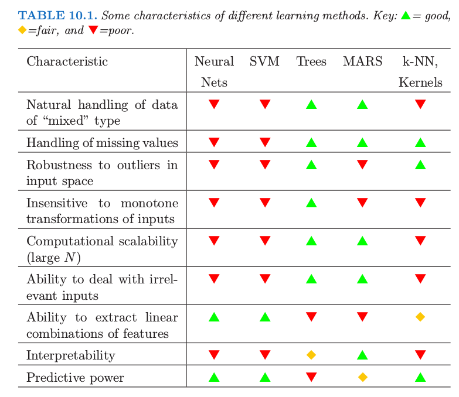

# Tree-Based Methods

Mostly based on **ESL** and **ISLR**, plus other things I came across.

# Definitions

**Bayes Error Rate**

In statistical classification, Bayes error rate is the lowest possible error
rate for any classifier of a random outcome (into, for example, one of two
categories) and is analogous to the irreducible error. (source:
[wiki](https://en.wikipedia.org/wiki/Bayes_error_rate))

# Libraries

`R` package `tree`, useful function:

* `cv.tree()` performances cross-validation in order to determine the
complexity of the tree.
* `predict()`
* `prune.tree()`

`R` package `randomForest`:

* `importance()` - variable importance
* `varImpPlot()` - plot variable importance

`R` package `gbm` for boosting trees.

# Decision Trees

One major problem with trees is their high variance.


## Tree Building

Generally, given feature space $X = {X_1, X_2, \cdots, X_p}$, split into $J$
distinct and non-overlapping regions, ${R_1, R_2, \cdots, R_J}$.

For regression problems, for each sample that falls into $R_j$,
predict using the mean of the training data in $R_j$.

For each iteration, first find the best predictor and then the best split
point that leads to the **largest reduction in RSS**.

The splits are done by applying **recursive binary splitting**.
For each split points, at each split, we choose $s$ where the it results in
the **largest reduction in RSS**.

Next, we repeat this process within each of the two regions defined by the
steps above. Hence the process is greedy.


## Tree Pruning

A better strategy is to grow a very large tree $T_0$, then **prune** it back
in order to obtain a subtree that leads to lowest test error.

**Cost complexity pruning**, a.k.a. **weakest link pruning**: consider a
sequence of trees indexed by nonnegative tuning parameter $\alpha$. For each
value of $\alpha$ there corresponds a subtree $T \in T_0$ such that:

$$ \sum_{m=1}^{|T|} \sum_{x_i \in R_m} \big(y_i - \hat{y}_{R_m} \big)^2 + \alpha |T| $$

is as small as possible.

* $|T|$ indicates the number of terminal nodes of the tree $T$.
* $R_m$ is the rectangle (i.e. the subset of predictor space) corresponding to
the $m^{th}$ terminal node.
* $\hat{y}_{R_m}$ is the predicted response associated with $R_m$

$\alpha$ controls a trade-off between the subtree's complexity and its fit to
the training data. Turns out as we increase $\alpha$ from zero, branches get
pruned from the tree in a nested and predictable fashion. The value of
$\alpha$ can be found using cross-validation. Algorithm 8.1 on page 309 in
**ISLR** book.

# Bagging

Bootstrap aggreation, or bagging, builds $B$ regression trees with $B$
bootstrapped training set, and average the resulting predictions.
For classification, a majority vote is used.

The trees built are grown deep, and not pruned.
**Hence each tree has high variance but low variance**.

## Out-of-Bag Error Estimate

It can be shown that with bootstrapping, on average, each bagged tree makes
use of around 2/3 of the observations. The remaining 1/3 of the data is not
used to fit the tree, hence these are referred to as **out-of-bag** (OOB)
observations.

We can predict the response for the $i^{th}$ obervation using each of the
trees in which the observation was OOB. This yields around $B/3$ predictions
for the $i^{th}$ observation. We can use average of these (for regression) or
majority vote (for classification) to get a single OOB prediction for this
observation.

It can be shown that when $B$ is sufficiently large, OOB error is virtually
equivalent to leave-one-out cross-validation error.

# Variable Importance

## Regression

Record the total amount that the RSS is decreased due to splits over a given
predictor, averaged over all B trees. A **large** value indicates an important
predictor. **ISLR** p319.

$$ RSS = \sum_{j=1}^{J} \sum_{i \in R_j} \big(y_i - \hat{y}_{R_j} \big)^2 $$


## Classification

Three measures:

1. Misclassification error
2. Gini index
3. Cross-entropy

Add up the total amount that the **Gini index** is decreased by splits over a given predictor, averaged over all B trees.

$$ G = \sum_{k=1}^{K} \hat{p}_{mk}(1-\hat{p}_{mk}) $$

Where $\hat{p}_{mk}$ represents the proportion of training observations in the
$m^{th}$ **region** that are the from the $k^{th}$ class.

**Region**: they represent the terminal nodes in a tree. See **ESL** Ch 9.2, page 305 and Figure 9.2 on page 306.

Alternative to the Gini index is **cross-entropy**, given by:

$$ D = -\sum_{k=1}^{K} \hat{p}_{mk} \log \hat{p}_{mk} $$

Another measure of node **impurity** is **misclassification error**.
In a node $m$, representing region $R_m$ with $N_m$ obervations, with $k$ as
the class label

$$ E = \frac{1}{N_m}\sum_{i \in R_m} \mathit{I}(y_i \neq k(m)) = 1 - \hat{p}_{mk(m)} $$

Out of the three methods, both Gini and cross-entropy are differentiable, and
hence more amenable to numerical optimization. In additional, both of them are
more sensitive to changes in the node probabilities than the
missclassification rate. For this reason,
**either the Gini index or cross-entropy should be used when growing the tree**
.

For cost-complexity pruning, all three measures can be used, but typically missclassification rate is used.

## Permutation Importance for Random Forest Feature Importance

See this [post](http://parrt.cs.usfca.edu/doc/rf-importance/index.html),
[github](https://github.com/parrt/random-forest-importances)

`sklearn` Random Forest feature importance and `R`'s default Randome Forest
feature importance strategies are **biased**.

Solution is to compute **permutation importance** from Breiman and Cutler.
Existing packages:

* Python: `rfpimp` through `pip`
* R: use `importance=T` in random forest constructor then `type=1` and
`scale=F` in `R`'s `importance()` function.

Feature importance will only be reliable **if your model is trained with
suitable hyper-parameters**.

Permutation importance works for all models, not just random forests.
The procedure is as follows:

1. Train the model as usual
2. Record a baseline: score the model by passing a validation or test set.
3. For each feature (columns), permute the column values, compute the same
score.
4. The importance of a feature is **the difference of scores between the
baseline and the drop in score after permutation**.

The importance metrics here are **not** normalized and do not sum to 1.
The specific values of importance do not matter, what matters is the
**relative predictive strength**, i.e. ranking.

A more direct and accurate strategy is the **drop-column importance**.
This requires establishing a baseline, and then drop a feature column and
**re-train** the model. Clearly, this is more computationally intensive.
The importance measure is the drop of score from the baseline, as before.

Here's the code snippet from the post.

```
import numpy as np

def permutation_importances(rf, X_train, y_train, metric):
    baseline = metric(rf, X_train, y_train)
    imp = []
    for col in X_train.columns:
        save = X_train[col].copy()
        X_train[col] = np.random.permutation(X_train[col])
        m = metric(rf, X_train, y_train)
        X_train[col] = save
        imp.append(baseline - m)
    return np.array(imp)


def dropcol_importances(rf, X_train, y_train):
    rf_ = clone(rf)
    rf_.random_state = 999
    rf_.fit(X_train, y_train)
    baseline = rf_.oob_score_
    imp = []
    for col in X_train.columns:
        X = X_train.drop(col, axis=1)
        rf_ = clone(rf)
        rf_.random_state = 999
        rf_.fit(X, y_train)
        o = rf_.oob_score_
        imp.append(baseline - o)
    imp = np.array(imp)
    I = pd.DataFrame(
            data={'Feature':X_train.columns,
                  'Importance':imp})
    I = I.set_index('Feature')
    I = I.sort_values('Importance', ascending=True)
    return I
```

# Random Forest

For bagged trees, strong predictors will result in correlated trees, therefore the reduction in variance would be limited.

Random forest overcomes this issue by having each tree only using a
**randomly chosen** subset of $m$ predictors. Typically, $m = \sqrt{p}$,
where $p$ is the number of all predictors.

On average $(p - m)/p$ of the splits in a tree will not even consider the
strong predictor, so the other predictors would have a change.

Some measures of confidence for Random Forest have been developed, such as:

* [forestci](https://github.com/scikit-learn-contrib/forest-confidence-interval) package for `scikit-learn`
* [randomForestCI](https://github.com/swager/randomForestCI) for `R` and the associated paper.

See this [notebook](https://github.com/ianozsvald/data_science_delivered/blob/master/ml_explain_regression_prediction.ipynb) for examples.


# Extremely Randomized Trees

A.k.a. Extra Trees.

Similar to RF extra trees randomly choose **subsets of $m$ predictors**, split points are **randomly chosen**, but the **full training data** is used to train each tree (vs. RF which uses a resampled subset of the full training set).

Three parameters:

* $m$ - number of predictors to use, determines the strength of the attribute
selection process,
* $n_{min}$ - min sample size of a node required to split the node further,
the strength of the averaging output noise,
* $B$ - number of trees in the ensemble, the strength of variance reduction of
the ensemble.

Smaller $m$ leads to **larger** randomization. When the number of irrelavent
predictors increases, larger $m$ results in **better** results, since there is
a higher chance that relavent predictors are chosen.

Larger noise in output leads to larger optimal $n_{min}$.

Prediction error is a monotonically decreasing function of $B$ in
randomization methods.

# Boosting

(From ISLR)

Not using bootstrapping, trees are grown **sequentially**. Boosting creates
**slow learners**. Each tree can be rather small, with just a few terminal
nodes, determined by the **parameter** $d$ in the algorithm.

Given the current model, we fit a tree to the residuals from the model, then
we add this tree into the fitted function in order to update the residuals.

A shrinkage parameter $\lambda$ slows down learning further.

Third parameter is number of trees, B.

So generically there are **three** parameters:

1. No. of terminal nodes, $d$
2. learning rate $\lambda$
3. No. of trees, $B$

# Loss Function Robustness

**ESL** Ch 10.6

## Loss Functions

### Exponential Loss

$$ L(y, f(x)) = \exp(-y \cdot f(x)) $$

### Binominal Deviance Loss

$$ D = -l(Y, p(x)) = \log \big( 1 + e^{-2Y\cdot f(x)} \big) $$

### Multinominal Deviance Loss

$$
\begin{aligned}
L(y, p(x)) &= -\sum_{k=1}^{K} \mathit{I}(y = G_k) \log p_k(x) \\
&= -\sum_{k=1}^{K} \mathit{I}(y = G_k) f_k (x) + \log \big(\sum_{l=1}^{K} e^{f_l (x)}\big)
\end{aligned}
$$

### Huber Loss

$$
\begin{aligned}
L(y, f(x)) = \begin{cases}
[y - f(x)]^2 &\text{for } \left|y - f(x)\right| < \delta \\
2\delta \left|y - f(x)\right| - \delta^2 &\text{otherwise}
\end{cases}
\end{aligned}
$$

## Classification

Difference between exponential loss and binominal deviance is in degree. The
penalty associated with binominal deviance increases linearly for large
increasingly negative margin, whereas exponential criterion increases the
influence of such observations exponentially.

Therefore, **binomial deviance** is far more robust in noisy settings where
the Bayes error rate is not close to zero, and specifically in situations
where there is misspecification of the class labels in the training data.

## Regression

On finite samples **squared-error loss** places much more emphasis on
obervations with large absolute residual during the fitting process. Thus it
is far less robust and performance severely degrades especially for outliers.
More robust criteria such as **absolute loss**, performs much better in these
cases.

**Huber Loss** can be often better than either for error distribution with
moderately heavy tails.

# Misc

Some topics that I have not yet had time to look into:

* MARS (Multivariate Adaptive Regression Splines)
* HME (Hierarchical Mixtures of Experts) - tree split decisions are not hard
but soft probabilistic ones. However, at the time of writing the authors were
not aware of any method to find good tree topology for HME.

# Comparison

Source: ESL p351



# Gradient Boosting Trees

Nicely written series on GBM [here](https://explained.ai/gradient-boosting/index.html).

For **L1** loss, train boosters on the **sign of residual vectors**. The model is bootstrapped with the **median** of data points, and learns the group median. More robust against outliers.

For **L2** loss, train boosters on the **value of residual vectors**. The model is boostrapped with the **average** of data points, and learns the group average. More sensitive to outliers.


# XGBoost

`xgboost` now supports 3 base learners, one of which is `dart`, which applies
dropout from deep learning to MART.
Paper [here](http://proceedings.mlr.press/v38/korlakaivinayak15.pdf)

Tuning parameter
[docs](https://xgboost.readthedocs.io/en/latest/parameter.html)

# LightGBM

To install with GPU support:

```
pip install lightgbm --install-option=--gpu
```

Or build from source. GPU Tutorial has a section on installation
[here](https://lightgbm.readthedocs.io/en/latest/GPU-Tutorial.html).

Supports grouped categorical features, no need for one-hot encoding, which
**does not work well with trees** (tends to grow unbalanced trees and needs to
be very deep to achieve good accuracy), according to its docs on
[Features](https://lightgbm.readthedocs.io/en/latest/Features.html).

Parameter tuning [guide](https://lightgbm.readthedocs.io/en/latest/Parameters-Tuning.html). Key ones below:

* `num_leaves`, normally set to less than `2^(max_depth)`
* `min_data_in_leaf`, 100s or 1000s for large data set is often enough.
* `max_depth`


Also a section on GPU
[Tuning](https://lightgbm.readthedocs.io/en/latest/GPU-Performance.html#how-to-achieve-good-speedup-on-gpu).

Also a **great** [site](https://sites.google.com/view/lauraepp/parameters)
comparing the parameters of `xgboost` and `lightgbm`.

Good intro [post](http://mlexplained.com/2018/01/05/lightgbm-and-xgboost-explained/). Below is
a summary based on this post.

## Features

* Grow trees **leave-wise**, as opposed to **level-wise**.
    * Level-wise grows more balanced trees and can be seen as a regularized
    growth strategy.
    * Leave-wise can overfit easier, therefore is more suitable for **larger**
    data sets.
    * `xgboost` now supports both growth strategies.

* Use histogram based methods to find best splits, significant time save versus
finding split with all values of continuous features.
    * Trade off between speed and accuracy. More bins leads to slower speed
    but higher accuracy, vice verce.
    * How to construct the bins? Equal bin intervals often result in an
    **unbalanced** allocation of data. The **most balanced** method of dividing
    the bins depends on the **gradient statistics**.
    * `xgboost` offers parameter `tree_method='approx'` to compute a new set of
    bins at each split using gradient statistics.
    * both `lightgbm` and `xgboost` with `tree_method='hist'` will both
    compute the bins at the beginning of training and reuse the same bins
    throughout the training process.

* Ignore sparse inputs during split finding, then assign them to whichever
side that reduces the loss the most.
    * `xgboost` treats missing data and zero values the same.
    * `lightgbm` has option `zero_as_missing=True` to treat zeros the same
    as missing.
    * `lightgbm` by default treats missing values the same way as `xgboost`,
    via option `use_missing=True`.

* Subsampling the data - concentrate on data points with larger gradients.
    To avoid **biased** sampling, `lightgbm` also randomly samples from data
    with small gradients, with increased weights assigned to them when
    computing their loss contribution.

* Excusive feature bundling, some features are never non-zero at the same
time / in the same sample. Therefore they can be *bundled* together. However,
finding the most efficient bundle is NP-hard... `lightgbm` uses an
approximating algo to tolerat a certain degree of overlap $\gamma$ within
a feature bundle.
